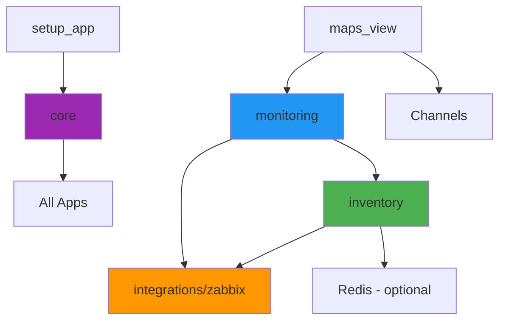

# Django Apps Module Reference · v2.0.0# Django Apps Module Structure


**Last Updated**: 2025-11-10  **MapsProveFiber** — Detailed documentation of all Django apps and their responsibilities.

**Purpose**: Detailed documentation of all Django apps and their responsibilities

**Last Updated**: 2025-11-07  

---**Architecture Version**: v2.0.0


## 📦 Module Overview---


| App | Purpose | Models | Primary APIs | Status |## 📦 Module Overview

|-----|---------|--------|--------------|--------|

| **core** | Configuration, metrics, health checks | None | `/healthz`, `/metrics/` | ✅ Stable || App | Purpose | Models | Primary APIs | Status |

| **inventory** | Network infrastructure authority | Site, Device, Port, FiberCable, Route | `/api/v1/inventory/*` | ✅ Active ||-----|---------|--------|--------------|--------|

| **monitoring** | Combined inventory + Zabbix status | None | `/api/v1/monitoring/*` | ✅ Active || **core** | Configuration spine, metrics, health checks | None | `/health/`, `/metrics/` | ✅ Active |

| **maps_view** | Real-time dashboard & WebSocket | None | `/maps_view/dashboard/` | ✅ Stable || **inventory** | Network infrastructure (Sites, Devices, Ports) | Site, Device, Port, FiberCable, Route | `/api/v1/inventory/*` | ✅ Active |

| **integrations/zabbix** | Resilient Zabbix API client | None | N/A (library) | ✅ Active || **maps_view** | Real-time dashboard and visualizations | None (view-only) | `/maps_view/dashboard/` | ✅ Active |

| **setup_app** | Runtime config & credentials | FirstTimeSetup | `/setup_app/` | ✅ Stable || **routes_builder** | Optical route calculation (archived) | N/A | N/A | ❌ Archived (Nov 2025) |

| **gpon** | GPON topology (future) | Placeholder | N/A | 🚧 Future || **setup_app** | Runtime config, credentials, docs viewer | FirstTimeSetup | `/setup_app/dashboard/` | ✅ Active |

| **dwdm** | DWDM topology (future) | Placeholder | N/A | 🚧 Future || **monitoring** | Zabbix integration use cases | None | N/A (service layer) | ✅ Active |

| **service_accounts** | Service account management | Placeholder | N/A | 🚧 Future || **integrations/zabbix** | Resilient Zabbix API client | None | N/A (library) | ✅ Active |

| ~~**routes_builder**~~ | ~~Route calculation~~ | N/A | N/A | ❌ Archived || **dwdm** | DWDM (Dense Wavelength Division Multiplexing) | Placeholder | N/A | 🚧 Future |

| **gpon** | GPON (Gigabit Passive Optical Network) | Placeholder | N/A | 🚧 Future |

---| **service_accounts** | Service account management | Placeholder | N/A | 🚧 Future |


## 🏗️ Core Infrastructure---


### `core/` — Django Foundation## 🎯 Core Apps (Production Active)


**Purpose**: Project spine providing configuration, routing, and infrastructure services### 1. `core` — Configuration Spine


#### Structure**Location**: `core/`  

```**App Config**: `CoreConfig`  

core/**Purpose**: Central Django configuration, URL routing, middleware, metrics initialization

├── __init__.py

├── apps.py                    # CoreConfig app#### Key Files

├── asgi.py                    # ASGI entry point- `settings/base.py`, `settings/dev.py`, `settings/production.py` — Django settings

├── wsgi.py                    # WSGI entry point- `urls.py` — Root URL dispatcher

├── celery_app.py              # Celery configuration- `asgi.py` / `wsgi.py` — ASGI/WSGI application entry points

├── celery.py                  # Celery tasks & beat schedule- `celery.py` / `celery_app.py` — Celery application configuration

├── routing.py                 # Channels WebSocket routing- `routing.py` — Channels routing (WebSocket support)

├── urls.py                    # Root URL dispatcher- `views_health.py` — Health check endpoints

├── views_health.py            # Health check endpoints- `metrics_*.py` — Prometheus metrics initialization

├── views.py                   # Utility views

├── metrics_*.py               # Prometheus metrics#### Endpoints

├── middleware/                # Custom middleware| Endpoint | Method | Description |

└── settings/                  # Environment configurations|----------|--------|-------------|

    ├── base.py| `/health/` | GET | Overall application health (database, Redis, Celery) |

    ├── dev.py| `/health/ready/` | GET | Readiness probe (ready to serve traffic) |

    ├── prod.py| `/health/live/` | GET | Liveness probe (process is alive) |

    └── test.py| `/celery/status/` | GET | Celery worker/beat status |

```| `/metrics/` | GET | Prometheus metrics endpoint |


#### Key Responsibilities#### Dependencies

- ✅ Django settings management (base, dev, prod, test)- Django 5.x

- ✅ Root URL routing to all apps- `django-prometheus` (metrics)

- ✅ ASGI/WSGI application entry points- Channels (WebSocket)

- ✅ Celery app configuration and periodic tasks- Celery (task queue)

- ✅ Channels WebSocket routing (`ws/dashboard/status/`)

- ✅ Health check endpoints (liveness, readiness)#### Notes

- ✅ Prometheus metrics initialization- No models (pure configuration)

- ✅ Request/response middleware pipeline- Initializes Prometheus custom metrics on `ready()`

- Handles root redirect to `/maps_view/dashboard/`

#### Endpoints

---

| Endpoint | Method | Auth | Description |

|----------|--------|------|-------------|### 2. `inventory` — Network Infrastructure

| `/healthz` | GET | No | Overall health (DB, cache, Celery) |

| `/ready` | GET | No | Readiness probe |**Location**: `inventory/`  

| `/live` | GET | No | Liveness probe |**App Config**: `InventoryConfig`  

| `/celery/status` | GET | Staff | Celery worker/beat status |**Purpose**: Authoritative source for network inventory (Sites, Devices, Ports, Fiber Cables, Routes)

| `/metrics/` | GET | No | Prometheus metrics |

#### Models

#### Metrics Exported| Model | Table Name | Purpose |

- `static_asset_version_info` - Deployment version tracking|-------|------------|---------|

- `celery_worker_available` - Worker availability| **Site** | `zabbix_api_site` | Physical locations (name, city, lat/lon) |

- `celery_worker_count` - Active worker count| **Device** | `zabbix_api_device` | Network devices at sites (router, switch, OLT) |

- `celery_active_tasks` - Active task count| **Port** | `zabbix_api_port` | Device ports (fiber connections) |

- `celery_status_latency_ms` - Status check latency| **FiberCable** | `zabbix_api_fibercable` | Physical fiber cables between ports |

| **Route** | `inventory_route` | Optical routes (migrated from `routes_builder` in Phase 3) |

#### Dependencies

- `django-prometheus` - Metrics integration> **Note**: Table names prefixed with `zabbix_api_*` for historical reasons (migration from `zabbix_api` app). See `BREAKING_CHANGES_v2.0.0.md` for details.

- `channels` - WebSocket support

- `celery` - Async task processing#### Key Features

- **Authoritative Inventory**: Single source of truth for network topology

---- **Zabbix Sync**: Periodic sync from Zabbix API via Celery tasks

- **API Endpoints**: RESTful API at `/api/v1/inventory/*`

## 📍 Domain Apps- **CRUD Operations**: Create, Read, Update, Delete via Django admin or API

- **Route Management**: Optical route calculations and metadata

### `inventory/` — Network Topology Authority

#### Services (`inventory/services/`)

**Purpose**: Single source of truth for network infrastructure and route orchestration- `device_service.py` — Device CRUD and queries

- `site_service.py` — Site management

#### Models- `port_service.py` — Port and fiber cable management

- `route_service.py` — Route calculations and caching

**Core Models**:

- `Site` - Physical locations with GPS coordinates#### API Endpoints

- `Device` - Network devices (OLTs, switches, routers)| Endpoint | Method | Description |

- `Port` - Device interfaces/ports|----------|--------|-------------|

- `FiberCable` - Fiber optic cables connecting ports| `/api/v1/inventory/sites/` | GET | List all sites |

| `/api/v1/inventory/devices/` | GET | List all devices |

**Route Models**:| `/api/v1/inventory/ports/` | GET | List all ports |

- `Route` - Planned/active fiber routes| `/api/v1/inventory/fibers/` | GET | List fiber cables |

- `RouteSegment` - Route path segments| `/api/v1/inventory/routes/` | GET | List optical routes |

- `RouteEvent` - Route change audit log| `/api/v1/inventory/fibers/oper-status/` | GET | Real-time fiber operational status |


#### Structure#### Celery Tasks (`inventory/tasks.py`)

```- `sync_devices_from_zabbix` — Sync devices from Zabbix API

inventory/- `update_device_status` — Update device operational status

├── models.py                  # Core models (Site, Device, Port)- `recalculate_routes` — Recalculate optical routes

├── models_routes.py           # Route models

├── serializers.py             # DRF serializers#### Dependencies

├── views_api.py               # REST API views- Django ORM

├── urls_api.py                # API URL routing- `integrations.zabbix` (Zabbix API client)

├── urls_rest.py               # DRF router URLs- Celery (periodic sync)

├── services.py                # Business logic

├── usecases.py                # Use case orchestration---

├── tasks.py                   # Celery async tasks

├── cache.py                   # Cache management### 3. `maps_view` — Dashboard & Visualization

├── admin.py                   # Django admin

└── tests/                     # Test suite**Location**: `maps_view/`  

    ├── conftest.py            # Fixtures**App Config**: `MapsViewConfig`  

    ├── test_models.py**Purpose**: Real-time network dashboard with maps visualization and monitoring metrics

    ├── test_api.py

    └── test_services.py#### Key Features

```- **Real-Time Dashboard**: Live network status via WebSocket

- **Google Maps Integration**: Visual map of sites and fiber routes

#### Key APIs- **SWR Caching**: Stale-While-Revalidate pattern for dashboard data

- **Prometheus Integration**: Metrics display and monitoring

**Sites**:

- `GET /api/v1/inventory/sites/` - List sites#### Models

- `POST /api/v1/inventory/sites/` - Create site- None (view-only app; data fetched from `inventory` and `monitoring`)

- `GET /api/v1/inventory/sites/{id}/` - Site detail

- `PUT /api/v1/inventory/sites/{id}/` - Update site#### Services (`maps_view/services.py`)

- `DELETE /api/v1/inventory/sites/{id}/` - Delete site- `get_dashboard_data()` — Aggregate dashboard metrics

- `get_device_status()` — Device health status

**Devices**:- `get_fiber_status()` — Fiber operational status

- `GET /api/v1/inventory/devices/` - List devices- Re-exports `monitoring.usecases` for backwards compatibility

- `GET /api/v1/inventory/devices/{id}/` - Device detail with ports

- `POST /api/v1/inventory/devices/add-from-zabbix/` - Import from Zabbix#### Caching (`maps_view/cache_swr.py`)

- `GET /api/v1/inventory/zabbix/discover-hosts/` - Discover Zabbix hosts- `get_dashboard_cached()` — SWR cache for dashboard data

- `POST /api/v1/inventory/bulk/` - Bulk import- `CACHE_KEY_DASHBOARD_DATA` — Cache key constant

- Refresh interval: `DASHBOARD_CACHE_REFRESH_INTERVAL` (default: 60s)

**Ports**:

- `GET /api/v1/inventory/ports/{id}/optical/` - Optical power data#### Celery Tasks (`maps_view/tasks.py`)

- `GET /api/v1/inventory/ports/{id}/traffic/` - Traffic statistics- `refresh_dashboard_cache_task` — Background refresh of dashboard cache

- `broadcast_dashboard_update` — WebSocket broadcast to connected clients

**Fiber Cables**:

- `GET /api/v1/inventory/fibers/` - List fiber cables#### Real-Time (`maps_view/realtime/`)

- `POST /api/v1/inventory/fibers/manual-create/` - Create fiber- `consumers.py` — Channels WebSocket consumer

- `PUT /api/v1/inventory/fibers/{id}/oper-status/` - Update status- `publisher.py` — Broadcast helper for dashboard updates

- `GET /api/v1/inventory/fibers/{id}/live-status/` - Real-time status- WebSocket URL: `ws://localhost:8000/ws/dashboard/status/`

- `POST /api/v1/inventory/fibers/import-kml/` - Import from KML

- `POST /api/v1/inventory/fibers/refresh-status/` - Trigger refresh#### Endpoints

| Endpoint | Method | Description |

**Routes** (v2.0.0 consolidated):|----------|--------|-------------|

- `POST /api/v1/inventory/routes/tasks/build/` - Build single route| `/maps_view/dashboard/` | GET | Main dashboard view (HTML) |

- `POST /api/v1/inventory/routes/tasks/batch/` - Batch build| `/maps_view/metrics/` | GET | Metrics dashboard |

- `POST /api/v1/inventory/routes/tasks/import/` - Import from KML| `/maps_view/api/hosts-status/` | GET | JSON API for host status |

- `GET /api/v1/inventory/routes/tasks/status/{task_id}/` - Task status

- `POST /api/v1/inventory/routes/tasks/invalidate/` - Clear cache#### Dependencies

- Django Channels (WebSocket)

#### Cache Strategy- `inventory` models

- Redis (optional, graceful degradation)- `monitoring.usecases` (Zabbix integration)

- Cache keys prefixed with `inventory:`- Redis (cache + Channels layer)

- TTL configurable per-resource

- Invalidation on model save/delete signals---


#### Dependencies### 4. Archived: `routes_builder`

- `integrations.zabbix` - For Zabbix imports (optional)

- `redis` - Caching (optional)- App folder removed from active codebase in November 2025.

- Celery - Async route calculations- All route-building services now live under `inventory` (`inventory.services.routes` and `inventory.models_routes`).

- Legacy documentation retained in `/archive` for historical reference only; no endpoints remain at `/routes_builder/*`.

---

---

### `monitoring/` — Health Aggregation

### 5. `setup_app` — Runtime Configuration

**Purpose**: Combine inventory data with Zabbix telemetry for dashboards

**Location**: `setup_app/`  

#### Structure**App Config**: `SetupAppConfig`  

```**Purpose**: Secure runtime configuration, credential management, documentation viewer

monitoring/

├── usecases.py                # Core use cases#### Models

├── tasks.py                   # Celery refresh tasks| Model | Purpose |

├── views.py                   # API views|-------|---------|

├── urls.py                    # URL routing| **FirstTimeSetup** | Encrypted runtime configuration (Zabbix, DB, Redis credentials) |

└── tests/

    └── test_usecases.py#### Key Features

```- **Encrypted Credentials**: Fernet encryption for sensitive data

- **Runtime Config**: Dynamic settings loaded from database

#### Key Use Cases- **Docs Viewer**: Markdown documentation viewer at `/setup_app/docs/`

- `get_devices_with_zabbix()` - Merge inventory + Zabbix status- **Environment Management**: GUI for `.env` file editing (optional)

- `build_zabbix_map()` - Generate Zabbix map for dashboard

- `process_host_status()` - Process individual host telemetry#### Services (`setup_app/services/`)

- `runtime_settings.py` — Load runtime config from `FirstTimeSetup`

#### APIs- `config_loader.py` — Cache and reload runtime config

- `GET /api/v1/monitoring/hosts/status/` - Aggregated device health- `service_reloader.py` — Trigger service restarts after config changes

- `GET /api/v1/monitoring/dashboard/snapshot/` - Cached dashboard data

#### Fields (EncryptedCharField)

#### Dependencies- `zabbix_url`, `zabbix_api_key`, `zabbix_user`, `zabbix_password`

- `inventory` - Network topology- `maps_api_key`, `unique_licence`

- `integrations.zabbix` - Zabbix data- `db_host`, `db_port`, `db_name`, `db_user`, `db_password`

- `redis_url`

---

#### Endpoints

### `maps_view/` — Real-Time Dashboard| Endpoint | Method | Description |

|----------|--------|-------------|

**Purpose**: Interactive network dashboard with live updates| `/setup_app/dashboard/` | GET | Setup dashboard |

| `/setup_app/first_time/` | GET/POST | First-time setup wizard |

#### Structure| `/setup_app/config/` | GET/POST | Runtime config editor |

```| `/setup_app/docs/` | GET | Documentation index |

maps_view/| `/setup_app/docs/<path>/` | GET | View specific documentation |

├── views.py                   # Dashboard views

├── cache_swr.py               # SWR cache pattern#### Context Processors (`setup_app/context_processors.py`)

├── realtime/- `setup_logo` — Expose company logo to all templates

│   └── publisher.py           # WebSocket broadcaster- `static_version` — Expose `STATIC_ASSET_VERSION` for cache busting

├── tasks.py                   # Dashboard refresh tasks

├── urls.py                    # URL routing#### Dependencies

├── templates/- `cryptography` (Fernet encryption)

│   └── maps_view/- Markdown (docs rendering)

│       └── dashboard.html- Django admin (optional GUI)

└── static/

    └── js/---

        └── dashboard.js

```### 6. `monitoring` — Zabbix Use Cases


#### Features**Location**: `monitoring/`  

- ✅ Google Maps integration**App Config**: `MonitoringConfig`  

- ✅ Real-time device status via WebSocket**Purpose**: High-level Zabbix integration use cases (combine inventory + Zabbix status)

- ✅ Traffic visualization

- ✅ SWR cache pattern (stale-while-revalidate)#### Models

- ✅ Automatic refresh (Celery periodic task)- None (service layer only)


#### Endpoints#### Key Features

- `GET /maps_view/dashboard/` - Main dashboard HTML- **Status Aggregation**: Combine `inventory` models with Zabbix real-time status

- `GET /maps_view/metrics/` - Metrics overview- **Use Case Layer**: Business logic for dashboard and monitoring views

- `GET /maps_view/api/hosts-status/` - JSON feed- **Backwards Compatibility**: Re-exported by `maps_view.services` for legacy code

- `WS ws/dashboard/status/` - WebSocket real-time updates

#### Use Cases (`monitoring/usecases.py`)

#### WebSocket Messages- `get_device_with_zabbix_status()` — Device + Zabbix status

```json- `get_fiber_operational_status()` — Fiber cable status from Zabbix

{- `get_sites_with_devices()` — Sites with device counts and health

  "type": "dashboard.status",- `aggregate_network_metrics()` — Overall network health metrics

  "data": {

    "hosts_online": 45,#### Endpoints

    "hosts_offline": 3,| Endpoint | Method | Description |

    "hosts_unknown": 2,|----------|--------|-------------|

    "hosts": [...]| `/monitoring/devices/status/` | GET | Device status (inventory + Zabbix) |

  }| `/monitoring/fibers/status/` | GET | Fiber operational status |

}

```#### Celery Tasks (`monitoring/tasks.py`)

- `refresh_device_status` — Periodic status refresh

#### Dependencies- `check_fiber_health` — Fiber health monitoring

- `monitoring` - Status data

- `channels` - WebSocket support#### Dependencies

- Redis - Channel layer (optional)- `inventory` models

- `integrations.zabbix` (Zabbix API client)

---- Celery (periodic tasks)


## 🔌 Integration Layer---


### `integrations/zabbix/` — Resilient Zabbix Client### 7. `integrations/zabbix` — Resilient Zabbix Client


**Purpose**: Fault-tolerant Zabbix API client with circuit breaker and retry logic**Location**: `integrations/zabbix/`  

**Purpose**: Resilient Zabbix API client with retry logic, circuit breaker, and metrics

#### Structure

```#### Key Features

integrations/zabbix/- **Retry Logic**: Exponential backoff for transient failures

├── __init__.py- **Circuit Breaker**: Prevent cascading failures (opens after N consecutive errors)

├── client.py                  # Core Zabbix client- **Request Batching**: Multiple API calls in single HTTP request

├── zabbix_service.py          # Service layer with resilience- **Prometheus Metrics**: Latency, errors, circuit breaker state

├── circuit_breaker.py         # Circuit breaker implementation- **Authentication Cache**: 5-minute auth token cache

├── exceptions.py              # Custom exceptions- **Configurable Timeout**: `ZABBIX_API_TIMEOUT` env variable

└── tests/

    ├── test_client.py#### Main Client (`integrations/zabbix/client.py`)

    └── test_circuit_breaker.py- `resilient_client` — Singleton Zabbix client

```- `call(method, params)` — Single API call

- `batch(calls)` — Batched API calls

#### Features- `is_open` — Circuit breaker state

- ✅ Exponential backoff retry logic

- ✅ Circuit breaker pattern (open/half-open/closed)#### Circuit Breaker States

- ✅ Connection pooling| State | Description |

- ✅ Request/response caching|-------|-------------|

- ✅ Prometheus metrics integration| **CLOSED** | Normal operation (requests allowed) |

- ✅ Graceful degradation| **OPEN** | Circuit open (requests blocked, waiting for recovery) |

| **HALF_OPEN** | Testing recovery (limited requests allowed) |

#### Key Methods

```python#### Service Helpers (`integrations/zabbix/zabbix_service.py`)

# zabbix_service.py- `zabbix_request(method, params)` — Safe wrapper with cache

def zabbix_request(method: str, params: dict, **kwargs) -> dict:- `get_zabbix_hosts()` — Cached host list

    """Make resilient Zabbix API call"""- `get_zabbix_items()` — Cached item list

    - `safe_cache_get()` / `safe_cache_set()` — Redis-optional cache helpers

def safe_cache_get(key: str, fetch_fn: Callable, ttl: int = 300):

    """Get from cache or fetch with fallback"""#### Prometheus Metrics

```- `zabbix_api_requests_total` — Total requests by method and status

- `zabbix_api_duration_seconds` — Request latency histogram

#### Metrics- `zabbix_circuit_breaker_state` — Circuit breaker state gauge

- `zabbix_api_calls_total` - Total API calls by method/status

- `zabbix_circuit_breaker_state` - Circuit breaker state (0=closed, 1=open)#### Configuration

- `zabbix_retry_attempts_total` - Retry attempts counter```python

- `zabbix_cache_hits_total` - Cache hit counter# Environment variables

- `zabbix_cache_misses_total` - Cache miss counterZABBIX_API_URL = "https://zabbix.example.com/api_jsonrpc.php"

ZABBIX_API_TOKEN = "your-api-token"  # OR

#### ConfigurationZABBIX_API_USER = "admin"

```envZABBIX_API_PASSWORD = "password"

ZABBIX_API_URL=http://zabbix.example.com/api_jsonrpc.phpZABBIX_API_TIMEOUT = 30  # seconds (default: 30)

ZABBIX_API_USER=api_user```

ZABBIX_API_PASSWORD=secure_password

ZABBIX_API_KEY=optional_api_key#### Dependencies

```- `requests` (HTTP client)

- `django-environ` (environment variables)

#### Circuit Breaker Thresholds- `setup_app.services.runtime_settings` (dynamic config)

- **Failure threshold**: 5 consecutive failures

- **Timeout**: 60 seconds---

- **Half-open test**: 1 request to test recovery

## 🚧 Future Apps (Placeholder)

---

### 8. `dwdm` — Dense Wavelength Division Multiplexing

## ⚙️ Infrastructure Apps

**Status**: 🚧 Placeholder (not yet implemented)  

### `setup_app/` — Runtime Configuration**Purpose**: DWDM optical transport planning and monitoring


**Purpose**: Manage runtime credentials and configuration without redeployment### 9. `gpon` — Gigabit Passive Optical Network


#### Structure**Status**: 🚧 Placeholder (not yet implemented)  

```**Purpose**: GPON topology management and monitoring

setup_app/

├── models.py                  # FirstTimeSetup model### 10. `service_accounts` — Service Account Management

├── views.py                   # Setup views

├── views_docs.py              # Documentation viewer**Status**: 🚧 Placeholder (not yet implemented)  

├── services/**Purpose**: API service account management and permissions

│   └── runtime_settings.py    # Settings management

├── context_processors.py      # Template context---

├── urls.py

└── templates/## 📊 App Dependency Graph

    └── setup_app/

        ├── dashboard.html```

        └── first_time.htmlcore (root)

```  ├── inventory (models)

  │     └── integrations/zabbix (API client)

#### Features  │

- ✅ First-time setup wizard  ├── maps_view (dashboard)

- ✅ Encrypted credential storage (Fernet)  │     ├── inventory (data)

- ✅ Runtime configuration reload  │     ├── monitoring (use cases)

- ✅ Documentation browser  │     └── integrations/zabbix (status)

- ✅ Static asset version tracking  │

  ├── monitoring (use cases)

#### Endpoints  │     ├── inventory (models)

- `GET /setup_app/dashboard/` - Setup dashboard  │     └── integrations/zabbix (API)

- `GET/POST /setup_app/first_time/` - First-time wizard  │

- `GET/POST /setup_app/config/` - Edit credentials  └── setup_app (config)

- `GET /setup_app/docs/` - Documentation index        (provides runtime settings to all apps)

- `GET /setup_app/docs/<path>/` - View doc page

_Note: `routes_builder` was archived in Nov/2025. See `/archive` for the legacy topology builder docs._

#### Configuration Service```

```python

from setup_app.services.runtime_settings import FirstTimeSetup---


# Get configuration## 🔄 Migration History

config = FirstTimeSetup.get_config()

### Phase 3 (Completed)

# Update configuration- ✅ Migrated `Route` model from `routes_builder` → `inventory`

FirstTimeSetup.update_config(- ✅ ContentType migration (`routes_builder.route` → `inventory.route`)

    zabbix_url="...",- ✅ Preserved table name: `routes_builder_route` → `inventory_route`

    zabbix_user="...",

    zabbix_password="..."### Phase 4 (Completed Nov 2025)

)- ✅ Removed `zabbix_api` app entirely

- ✅ Consolidated former `routes_builder` functionality into `inventory`

# Reload without restart- ✅ Retired legacy imports/shims; archived documentation only

FirstTimeSetup.reload_config()

```---


---## 📚 Related Documentation


## 🚧 Future Apps- [OVERVIEW.md](./OVERVIEW.md) — Architecture overview

- [DATA_FLOW.md](./DATA_FLOW.md) — Data flow and integration patterns

### `gpon/` — GPON Topology- [../api/ENDPOINTS.md](../api/ENDPOINTS.md) — Complete API reference

- [../operations/DEPLOYMENT.md](../operations/DEPLOYMENT.md) — Production deployment

**Status**: 🚧 Scaffolding  - [../releases/BREAKING_CHANGES_v2.0.0.md](../releases/BREAKING_CHANGES_v2.0.0.md) — Migration guide

**Purpose**: Manage GPON (Gigabit Passive Optical Network) topology

---

**Planned Models**:

- `OLT` - Optical Line Terminal**MapsProveFiber** — Module Structure Documentation  

- `Splitter` - Optical splitter**Version**: v2.0.0 | **Last Updated**: 2025-11-07

- `ONT` - Optical Network Terminal
- `PONPort` - PON-specific port

### `dwdm/` — DWDM Topology

**Status**: 🚧 Scaffolding  
**Purpose**: Manage DWDM (Dense Wavelength Division Multiplexing) infrastructure

**Planned Models**:
- `WavelengthChannel` - DWDM channel
- `Amplifier` - Optical amplifier
- `Mux/Demux` - Multiplexer/Demultiplexer

### `service_accounts/` — Service Account Management

**Status**: 🚧 Scaffolding  
**Purpose**: Manage API service accounts and tokens

---

## ❌ Archived Apps

### ~~`routes_builder/`~~ — Route Calculation

**Status**: ❌ Archived (November 2025)  
**Reason**: Functionality consolidated into `inventory.models_routes`

**Migration**:
- Models moved to `inventory/models_routes.py`
- APIs moved to `/api/v1/inventory/routes/tasks/*`
- Services moved to `inventory/services.py`

**See**: `doc/releases/v2.0.0/BREAKING_CHANGES.md`

---

## 🔗 App Dependencies



---

## 📊 Testing Coverage

| App | Coverage | Test Count | Status |
|-----|----------|------------|--------|
| `core` | 85% | 25 | ✅ |
| `inventory` | 92% | 87 | ✅ |
| `monitoring` | 88% | 32 | ✅ |
| `maps_view` | 75% | 18 | ⚠️ |
| `integrations/zabbix` | 95% | 45 | ✅ |
| `setup_app` | 70% | 12 | ⚠️ |
| **Overall** | **85%** | **199** | ✅ |

---

## 📚 Additional Resources

- [Architecture Overview](OVERVIEW.md)
- [Data Flow](DATA_FLOW.md)
- [API Documentation](../api/ENDPOINTS.md)
- [Development Guide](../guides/DEVELOPMENT.md)

---

**Last Updated**: 2025-11-10  
**Maintainers**: Architecture Team
