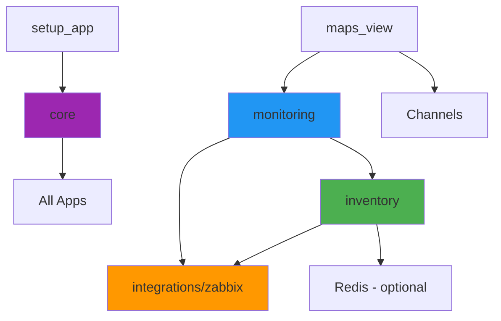

# Django Apps Module Reference

**Versão do produto**: ver [VERSION](../../VERSION)  
**Last Updated**: 2026-10-04  
**MapsProveFiber** — Detailed documentation of all Django apps and their responsibilities.

---

## 📦 Module Overview

| App | Purpose | Models | Primary APIs | Status |
|-----|---------|--------|--------------|--------|
| **core** | Configuration, metrics, health checks | None | `/healthz`, `/metrics/` | ✅ Stable |
| **inventory** | Network infrastructure authority | Site, Device, Port, FiberCable, Route | `/api/v1/inventory/*` | ✅ Active |
| **monitoring** | Combined inventory + Zabbix status | None | `/api/v1/monitoring/*` | ✅ Active |
| **maps_view** | Real-time dashboard & WebSocket | None | `/maps_view/dashboard/` | ✅ Stable |
| **integrations/zabbix** | Resilient Zabbix API client | None | N/A (library) | ✅ Active |
| **setup_app** | Runtime config & credentials | FirstTimeSetup | `/setup_app/` | ✅ Stable |
| **service_accounts** | Service account and token management | ServiceAccount, ServiceAccountToken, ServiceAccountAuditLog | N/A | ✅ Active (tokens not yet consumed by an auth class — EV-0023) |
| **gpon** | GPON topology (future) | Placeholder | N/A | 🚧 Future |
| **dwdm** | DWDM topology (future) | Placeholder | N/A | 🚧 Future |
| ~~**routes_builder**~~ | ~~Route calculation~~ | N/A | N/A | ❌ Archived |

---

## 🏗️ Core Infrastructure

### `core/` — Django Foundation

**Purpose**: Project spine providing configuration, routing, and infrastructure services

#### Structure

```
core/
├── __init__.py
├── apps.py                    # CoreConfig app
├── asgi.py                    # ASGI entry point
├── wsgi.py                    # WSGI entry point
├── celery_app.py              # Celery configuration
├── celery.py                  # Celery tasks & beat schedule
├── routing.py                 # Channels WebSocket routing
├── urls.py                    # Root URL dispatcher
├── views_health.py            # Health check endpoints
├── views.py                   # Utility views
├── views_auth.py              # Two-step login (password + TOTP)
├── api_users.py               # User management API
├── metrics_*.py               # Prometheus metrics
└── middleware/                # Custom middleware

settings/                      # backend/settings/ (top level, not inside core/)
├── base.py
├── dev.py
├── prod.py
└── test.py
```

#### Key Responsibilities

- ✅ Django settings management (base, dev, prod, test)
- ✅ Root URL routing to all apps
- ✅ ASGI/WSGI application entry points
- ✅ Celery app configuration and periodic tasks
- ✅ Channels WebSocket routing (`ws/dashboard/status/`)
- ✅ Health check endpoints (liveness, readiness)
- ✅ Prometheus metrics initialization
- ✅ Request/response middleware pipeline

#### Endpoints

| Endpoint | Method | Auth | Description |
|----------|--------|------|-------------|
| `/healthz` | GET | No | Overall health (DB, cache, Celery) |
| `/ready` | GET | No | Readiness probe |
| `/live` | GET | No | Liveness probe |
| `/celery/status` | GET | Staff | Celery worker/beat status |
| `/metrics/` | GET | No | Prometheus metrics |

#### Metrics Exported

- `static_asset_version_info` - Deployment version tracking
- `celery_worker_available` - Worker availability
- `celery_worker_count` - Active worker count
- `celery_active_tasks` - Active task count
- `celery_status_latency_ms` - Status check latency

#### Dependencies

- `django-prometheus` - Metrics integration
- `channels` - WebSocket support
- `celery` - Async task processing

---

## 📍 Domain Apps

### `inventory/` — Network Topology Authority

**Purpose**: Single source of truth for network infrastructure and route orchestration

#### Models

**Core Models**:
- `Site` - Physical locations with GPS coordinates
- `Device` - Network devices (OLTs, switches, routers)
- `Port` - Device interfaces/ports
- `FiberCable` - Fiber optic cables connecting ports

**Route Models**:
- `Route` - Planned/active fiber routes
- `RouteSegment` - Route path segments
- `RouteEvent` - Route change audit log

> **Note**: the original tables keep their legacy names via `Meta.db_table` (`zabbix_api_site`, `zabbix_api_device`, `zabbix_api_port`, `zabbix_api_fibercable`, ...). These are inherited table names; the models live in `inventory`.

#### Structure

```
inventory/
├── models.py                  # Core models (Site, Device, Port, FiberCable, ...)
├── models_routes.py           # Route models
├── serializers.py             # DRF serializers
├── viewsets.py                # DRF viewsets
├── api/                       # REST function views (devices, fibers, routes, ...)
├── urls_api.py                # API URL routing (/api/v1/inventory/*)
├── urls_rest.py               # DRF router URLs (/api/v1/sites/, /devices/, ...)
├── services/                  # Reusable helpers
├── usecases/                  # Business logic returning dicts
├── domain/                    # Pure domain helpers (geometry, kml, optical, zabbix_history)
├── routes/                    # Route build orchestration (services.py, tasks.py)
├── tasks.py                   # Celery async tasks
├── cache/                     # Cache management
├── admin.py                   # Django admin
└── tests/                     # Test suite
```

#### Key APIs

**Sites**:
- `GET /api/v1/inventory/sites/` - List sites
- Full CRUD (create, detail, update, delete) goes through the DRF router: `/api/v1/sites/`, `/api/v1/devices/`, `/api/v1/ports/`, `/api/v1/fiber-cables/` (`inventory/viewsets.py`)

**Devices**:
- `GET /api/v1/inventory/devices/{id}/` - Device detail with ports
- `POST /api/v1/inventory/devices/add-from-zabbix/` - Import from Zabbix
- `GET /api/v1/inventory/zabbix/discover-hosts/` - Discover Zabbix hosts
- `POST /api/v1/inventory/bulk/` - Bulk import

**Ports**:
- `GET /api/v1/inventory/ports/{id}/optical/` - Optical power data
- `GET /api/v1/inventory/ports/{id}/traffic/` - Traffic statistics

**Fiber Cables**:
- `GET /api/v1/inventory/fibers/` - List fiber cables
- `POST /api/v1/inventory/fibers/manual-create/` - Create fiber
- `PUT /api/v1/inventory/fibers/{id}/oper-status/` - Update status
- `GET /api/v1/inventory/fibers/{id}/live-status/` - Real-time status
- `POST /api/v1/inventory/fibers/import-kml/` - Import from KML
- `POST /api/v1/inventory/fibers/refresh-status/` - Trigger refresh

**Routes** (consolidated in `inventory` since the 2025-01 refactoring):
- `POST /api/v1/inventory/routes/tasks/build/` - Build single route
- `POST /api/v1/inventory/routes/tasks/batch/` - Batch build
- `POST /api/v1/inventory/routes/tasks/import/` - Import from KML
- `GET /api/v1/inventory/routes/tasks/status/{task_id}/` - Task status
- `POST /api/v1/inventory/routes/tasks/invalidate/` - Clear cache

#### Cache Strategy

- Redis (optional, graceful degradation)
- Cache keys prefixed with `inventory:`
- TTL configurable per-resource
- Invalidation on model save/delete signals

#### Dependencies

- `integrations.zabbix` - For Zabbix imports (optional)
- `redis` - Caching (optional)
- Celery - Async route calculations

---

### `monitoring/` — Health Aggregation

**Purpose**: Combine inventory data with Zabbix telemetry for dashboards

#### Structure

```
monitoring/
├── usecases.py                # Core use cases
├── tasks.py                   # Celery refresh tasks
├── views.py                   # API views
├── urls.py                    # URL routing
├── urls_api.py                # API URL routing (/api/v1/monitoring/*)
└── tests/
    └── test_usecases.py
```

#### Key Use Cases

- `get_devices_with_zabbix()` - Merge inventory + Zabbix status
- `build_zabbix_map()` - Generate Zabbix map for dashboard
- `process_host_status()` - Process individual host telemetry

#### APIs

- `GET /api/v1/monitoring/hosts/status/` - Aggregated device health
- `GET /api/v1/monitoring/dashboard/snapshot/` - Cached dashboard data

#### Dependencies

- `inventory` - Network topology
- `integrations.zabbix` - Zabbix data

---

### `maps_view/` — Real-Time Dashboard

**Purpose**: Interactive network dashboard with live updates

#### Structure

```
maps_view/
├── views.py                   # Dashboard views
├── cache_swr.py               # SWR cache pattern
├── mapbox_proxy.py            # Mapbox API proxy
├── realtime/
│   ├── consumers.py           # WebSocket consumer
│   ├── events.py              # Payload builders
│   └── publisher.py           # WebSocket broadcaster
├── tasks.py                   # Dashboard refresh tasks
├── urls.py                    # URL routing
├── templates/
│   ├── dashboard.html
│   └── metrics_dashboard.html
└── static/
    └── js/
        ├── dashboard.js
        └── traffic_chart.js
```

#### Features

- ✅ Google Maps integration
- ✅ Real-time device status via WebSocket
- ✅ Traffic visualization
- ✅ SWR cache pattern (stale-while-revalidate)
- ✅ Automatic refresh (Celery periodic task)

#### Endpoints

- `GET /maps_view/dashboard/` - Main dashboard HTML
- `GET /maps_view/metrics/` - Metrics overview
- `GET /maps_view/api/dashboard/data/` - JSON feed (hosts status + summary)
- `GET /maps_view/api/dashboard/sites/` - JSON feed (sites with grouped devices)
- `WS ws/dashboard/status/` - WebSocket real-time updates

#### WebSocket Messages

```json
{
  "event": "dashboard.status",
  "version": 1,
  "timestamp": "2026-10-04T12:00:00+00:00",
  "data": {
    "summary": {"...": "..."},
    "hosts": [...]
  }
}
```

Cable status changes are published on the same socket as `{"type": "cable_status_update", ...}`.

#### Dependencies

- `monitoring` - Status data
- `channels` - WebSocket support
- Redis - Channel layer (optional)

---

## 🔌 Integration Layer

### `integrations/zabbix/` — Resilient Zabbix Client

**Purpose**: Fault-tolerant Zabbix API client with circuit breaker and retry logic

#### Structure

```
integrations/zabbix/
├── __init__.py
├── client.py                  # ResilientZabbixClient + circuit breaker (resilient_client)
├── zabbix_client.py           # zabbix_request / zabbix_batch wrappers
├── zabbix_service.py          # Service layer (gateway) with cache helpers
├── guards.py                  # Guard helpers
└── decorators.py              # Decorators
```

#### Features

- ✅ Exponential backoff retry logic
- ✅ Circuit breaker pattern (open/half-open/closed)
- ✅ Connection pooling
- ✅ Request/response caching
- ✅ Prometheus metrics integration
- ✅ Graceful degradation

#### Key Methods

```python
# integrations/zabbix/zabbix_client.py (re-exported by zabbix_service.py)
def zabbix_request(method: str, params: dict | None = None, retry_without_auth: bool = False):
    """Make resilient Zabbix API call"""

# integrations/zabbix/zabbix_service.py
def safe_cache_get(key: str, default=None):
    """Get from cache (Redis optional), falling back to default"""
```

#### Metrics

- `zabbix_requests_total` - Total API calls by method/status
- `zabbix_request_duration_seconds` - Request latency histogram
- `zabbix_circuit_breaker_state` - Circuit breaker state (0=closed, 1=open, 2=half-open)
- `zabbix_retry_attempts_total` - Retry attempts counter

#### Configuration

```env
ZABBIX_API_URL=http://zabbix.example.com/api_jsonrpc.php
ZABBIX_API_USER=api_user
ZABBIX_API_PASSWORD=secure_password
ZABBIX_API_KEY=optional_api_key
```

#### Circuit Breaker Thresholds

- **Failure threshold**: 5 consecutive failures (`ZABBIX_CIRCUIT_BREAKER_THRESHOLD`)
- **Timeout**: 60 seconds (`ZABBIX_CIRCUIT_BREAKER_TIMEOUT`)
- **Half-open test**: 1 request to test recovery

---

## ⚙️ Infrastructure Apps

### `setup_app/` — Runtime Configuration

**Purpose**: Manage runtime credentials and configuration without redeployment

#### Structure

```
setup_app/
├── models.py                  # FirstTimeSetup model
├── views.py                   # Setup views
├── views_docs.py              # Documentation viewer
├── services/
│   └── runtime_settings.py    # Settings management
├── context_processors.py      # Template context
├── urls.py
└── templates/
    ├── setup_dashboard.html
    └── first_time_setup.html
```

#### Features

- ✅ First-time setup wizard
- ✅ Encrypted credential storage (Fernet)
- ✅ Runtime configuration reload
- ✅ Documentation browser
- ✅ Static asset version tracking

#### Endpoints

- `GET /setup_app/dashboard/` - Setup dashboard
- `GET/POST /setup_app/first_time/` - First-time wizard
- `GET/POST /setup_app/config/` - Edit credentials
- `GET /setup_app/docs/` - Documentation index
- `GET /setup_app/docs/<path>/` - View doc page

_Note: `routes_builder` was archived in Nov/2025. See `/archive` for the legacy topology builder docs._

#### Configuration Service

```python
from setup_app.services.runtime_settings import get_runtime_config, reload_config

# Get configuration (RuntimeConfig built from the FirstTimeSetup record)
config = get_runtime_config()

# Reload without restart (clears the cached configuration)
reload_config()
```

---

### `service_accounts/` — Service Account Management

**Status**: ✅ Implemented (models `ServiceAccount`, `ServiceAccountToken`, `ServiceAccountAuditLog`; rotation task in the Celery beat schedule)  
**Purpose**: Manage API service accounts and tokens  
**Note**: no authentication class consumes these tokens yet (see EV-0023).

---

## 🚧 Future Apps

### `gpon/` — GPON Topology

**Status**: 🚧 Scaffolding  
**Purpose**: Manage GPON (Gigabit Passive Optical Network) topology

**Planned Models**:
- `OLT` - Optical Line Terminal
- `Splitter` - Optical splitter
- `ONT` - Optical Network Terminal
- `PONPort` - PON-specific port

### `dwdm/` — DWDM Topology

**Status**: 🚧 Scaffolding  
**Purpose**: Manage DWDM (Dense Wavelength Division Multiplexing) infrastructure

**Planned Models**:
- `WavelengthChannel` - DWDM channel
- `Amplifier` - Optical amplifier
- `Mux/Demux` - Multiplexer/Demultiplexer

---

## ❌ Archived Apps

### ~~`routes_builder/`~~ — Route Calculation

**Status**: ❌ Archived (November 2025)  
**Reason**: Functionality consolidated into `inventory.models_routes`

**Migration**:
- Models moved to `inventory/models_routes.py`
- APIs moved to `/api/v1/inventory/routes/tasks/*`
- Services moved to `inventory/routes/services.py`

**See**: `doc/releases/v2.0.0/BREAKING_CHANGES.md`

### ~~`zabbix_api/`~~ — Legacy Inventory + Zabbix Module

**Status**: ❌ Removed (2025-01 refactoring)  
**Replaced by**: models in `inventory/` (tables keep the `zabbix_api_*` names), Zabbix client in `integrations/zabbix/`, status in `monitoring/`

---

## 🔗 App Dependencies


```mermaid
graph TD
    core[core] --> all[All Apps]

    inventory[inventory] --> zabbix[integrations/zabbix]
    inventory --> redis[Redis - optional]

    monitoring[monitoring] --> inventory
    monitoring --> zabbix

    maps_view[maps_view] --> monitoring
    maps_view --> channels[Channels]

    setup_app[setup_app] --> core

    style inventory fill:#4CAF50
    style monitoring fill:#2196F3
    style zabbix fill:#FF9800
    style core fill:#9C27B0
```

---

## 📊 Testing Coverage

Measured on 2026-10-04 (branch coverage, all apps; source: `CLAUDE.md` §9):

| App | Coverage |
|-----|----------|
| `core` | 83% |
| `inventory` | 48% |
| `monitoring` | 37% |
| `maps_view` | 90% |
| `integrations` | 52% |
| `setup_app` | 45% |
| `service_accounts` | 45% |
| `telemetry` | 28% |
| **Overall** | **51%** |

---

## 📚 Additional Resources

- [Architecture Overview](OVERVIEW.md)
- [Data Flow](DATA_FLOW.md)
- [API Documentation](../api/ENDPOINTS.md)
- [Development Guide](../guides/DEVELOPMENT.md)

---

**Last Updated**: 2026-10-04  
**Maintainers**: Architecture Team
