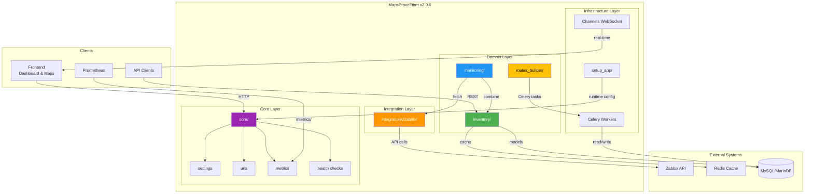
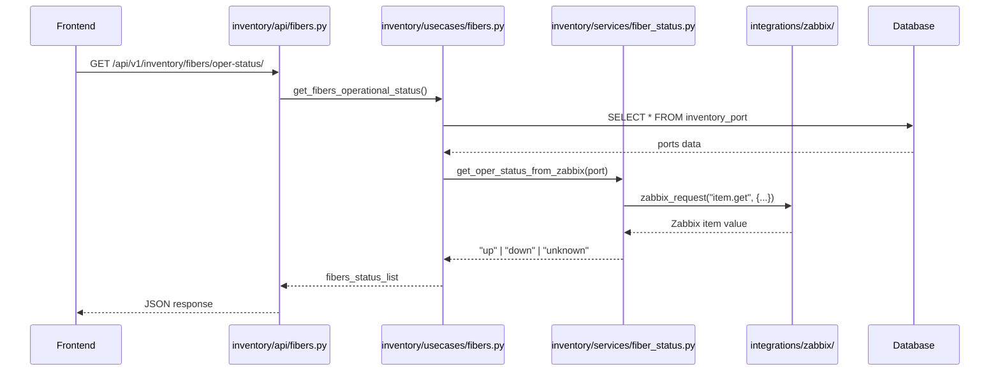
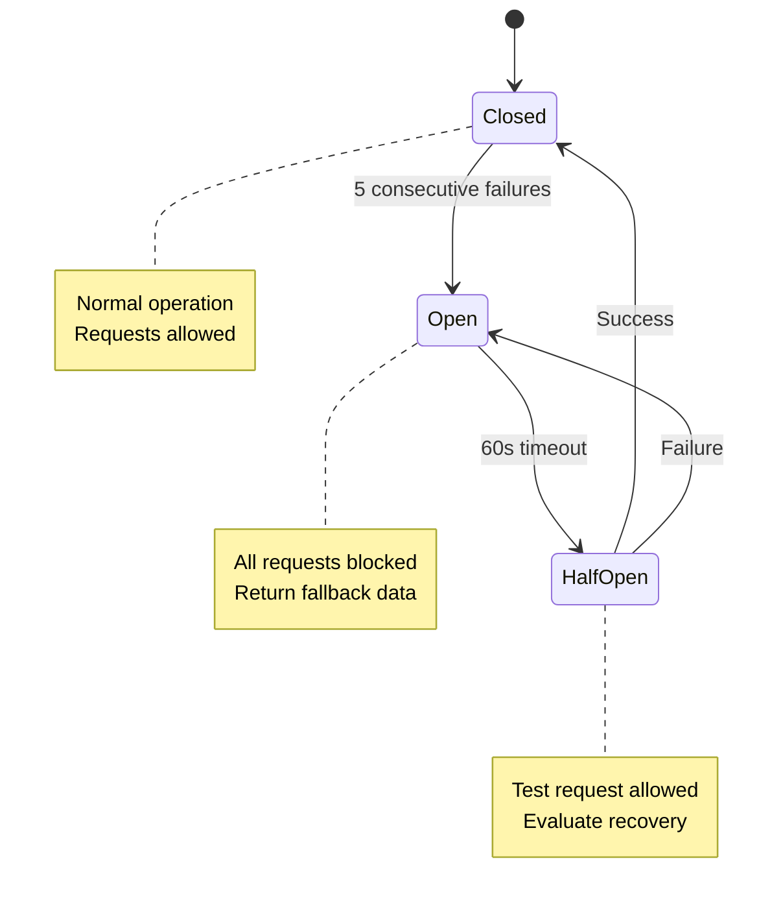
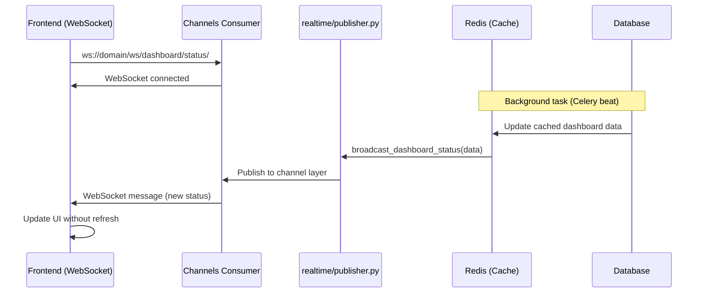
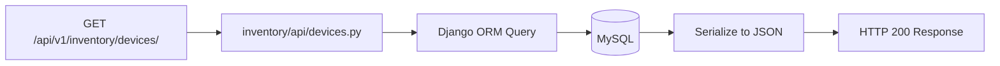
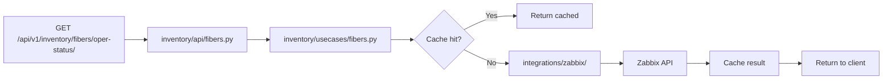
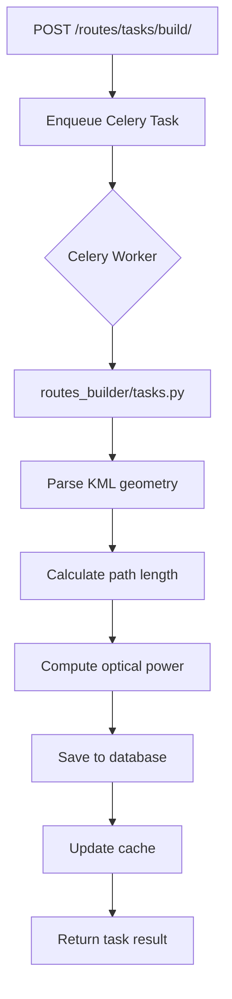
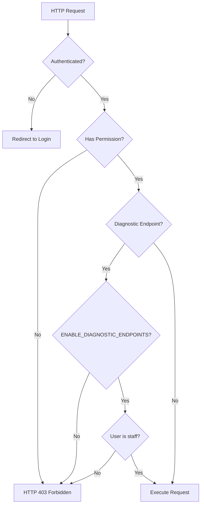
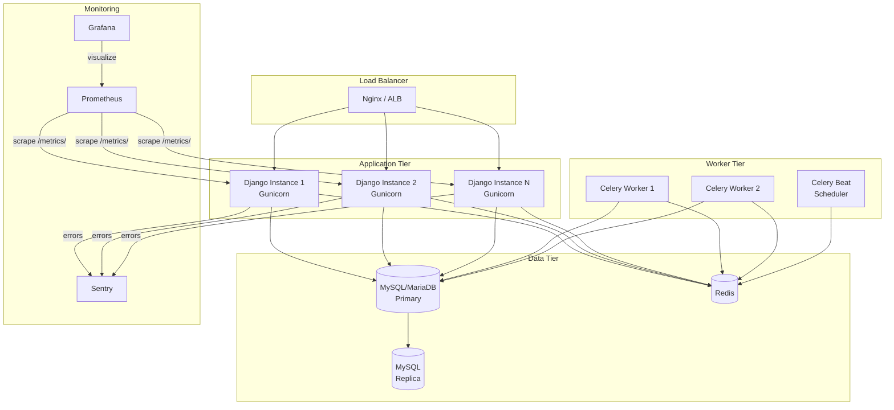
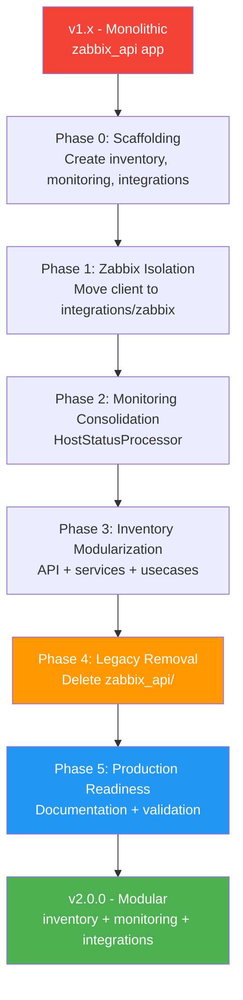

# Architecture Documentation - v2.0.0 Modular Design

**Project**: MapsProveFiber  
**Version**: v2.0.0  
**Architecture**: Modular Django Multi-App  
**Last Updated**: 2025-01-07

---

## 🎯 Overview

MapsProveFiber v2.0.0 introduces a **modular architecture** that separates concerns into distinct Django apps, each with a well-defined responsibility. This design improves maintainability, testability, and scalability while enabling independent evolution of each module.

### Design Principles

1. **Separation of Concerns**: Each app owns a specific domain (inventory, monitoring, integrations)
2. **Single Source of Truth**: Inventory app is the authoritative source for Sites, Devices, Ports, Routes
3. **Resilient Integrations**: Zabbix client isolated with circuit breaker, retry logic, metrics
4. **Service Layer Pattern**: Business logic in `services.py`, views stay thin
5. **API-First**: REST endpoints at `/api/v1/inventory/*` for all data access
6. **Graceful Degradation**: Redis cache optional, system continues without it

---

## 📦 Module Architecture

### High-Level Structure



### Module Responsibilities

| Module | Responsibility | Key Components | Status |
|--------|---------------|----------------|--------|
| **`core/`** | Django configuration, URL routing, metrics, health checks | settings, urls, ASGI, WSGI, Celery, middleware | ✅ Stable |
| **`inventory/`** | Authoritative data for Sites, Devices, Ports, Routes | models, API, services, usecases, cache | ✅ v2.0.0 |
| **`monitoring/`** | Health checks, combined Zabbix + inventory status | usecases, tasks, views | ✅ v2.0.0 |
| **`integrations/zabbix/`** | Resilient Zabbix API client | client, zabbix_service, circuit breaker | ✅ v2.0.0 |
| **`maps_view/`** | Real-time dashboard, WebSocket publisher | views, realtime, cache_swr, tasks | ✅ Stable |
| **`routes_builder/`** | Fiber route calculation (KML import, power calc) | services, tasks, views | ⚠️ Deprecated |
| **`setup_app/`** | Runtime settings, credential management | FirstTimeSetup, encryption | ✅ Stable |
| **`gpon/`** | GPON topology (future) | models | ⏳ Scaffolding |
| **`dwdm/`** | DWDM equipment (future) | models | ⏳ Scaffolding |

---

## 🗂️ Detailed Module Design

### 1. `inventory/` — Authoritative Data Layer

**Purpose**: Single source of truth for network inventory

```
inventory/
├── models.py                    # Site, Device, Port, Route (Django ORM)
├── urls_api.py                  # URL routing for /api/v1/inventory/*
├── api/
│   ├── devices.py              # GET /api/v1/inventory/devices/
│   ├── fibers.py               # GET /api/v1/inventory/fibers/
│   └── routes.py               # Route CRUD endpoints
├── cache/
│   ├── fibers.py               # invalidate_fiber_cache, helpers
│   └── device_status.py        # Status caching logic
├── domain/
│   ├── geometry.py             # sanitize_path_points, calculate_length
│   └── optical.py              # fetch_port_optical_snapshot
├── services/
│   ├── fiber_status.py         # get_oper_status_from_zabbix
│   ├── site_service.py         # SiteService (future)
│   └── device_service.py       # DeviceService (future)
├── usecases/
│   ├── devices.py              # bulk_create_inventory, add_device_from_zabbix
│   ├── fibers.py               # create_fiber_from_kml, live_status
│   └── ports.py                # device_ports, optical_snapshots
└── tests/
    ├── conftest.py             # Fixtures (create_test_site, etc.)
    └── test_*.py               # Unit & integration tests
```

**Key Patterns**:
- **Models**: Django ORM models (`Site`, `Device`, `Port`, `Route`)
- **API**: Thin controllers → delegate to usecases
- **Services**: Reusable helpers (fetch Zabbix data, compute status)
- **Usecases**: Complex workflows (bulk import, KML parsing)
- **Cache**: Redis-optional caching with graceful degradation

**Data Flow**:


---

### 2. `monitoring/` — Observability Layer

**Purpose**: Health checks, combined status from inventory + Zabbix

```
monitoring/
├── usecases.py          # HostStatusProcessor (combine Zabbix + inventory)
├── tasks.py             # Celery tasks for periodic checks
├── views.py             # Health endpoint views
└── tests/
    └── test_*.py
```

**Key Components**:
- **`HostStatusProcessor`**: Combines Zabbix availability with inventory device data
- **Tasks**: Periodic health checks, status aggregation (Celery beat)
- **Views**: `/healthz/`, `/ready/`, `/live/` endpoints

**Integration Pattern**:
```python
# monitoring/usecases.py
class HostStatusProcessor:
    @classmethod
    def get_combined_status(cls, device):
        # Fetch from inventory
        device_data = Device.objects.get(id=device.id)
        
        # Fetch from Zabbix
        zabbix_status = zabbix_request("host.get", {
            "hostids": device.zabbix_host_id,
            "output": ["available", "status"]
        })
        
        # Combine
        return {
            "device": device_data,
            "zabbix_available": zabbix_status[0]["available"],
            "combined_status": cls._evaluate_status(device_data, zabbix_status)
        }
```

---

### 3. `integrations/zabbix/` — External API Client

**Purpose**: Resilient, observable Zabbix API client

```
integrations/
└── zabbix/
    ├── client.py              # ResilientZabbixClient (circuit breaker, retry)
    ├── zabbix_service.py      # zabbix_request, safe_cache_* helpers
    └── README.md              # Client usage documentation
```

**Features**:
- ✅ **Automatic Retries**: Exponential backoff (3 attempts)
- ✅ **Circuit Breaker**: Opens after 5 consecutive failures
- ✅ **Request Batching**: Multiple calls in single HTTP request
- ✅ **Prometheus Metrics**: Latency, errors, circuit state
- ✅ **Authentication Cache**: 5-minute auth token cache
- ✅ **Graceful Degradation**: Returns fallback data on failure

**Client Usage**:
```python
from integrations.zabbix.client import resilient_client
from integrations.zabbix.zabbix_service import zabbix_request

# Method 1: Direct client (advanced)
hosts = resilient_client.call("host.get", {"output": ["hostid", "name"]})

# Method 2: Helper function (recommended)
hosts = zabbix_request("host.get", {"output": ["hostid", "name"]})
```

**Circuit Breaker State Machine**:


---

### 4. `core/` — Configuration & Infrastructure

**Purpose**: Django configuration, URL routing, observability

```
core/
├── settings/
│   ├── base.py              # Common settings
│   ├── development.py       # Dev overrides
│   ├── production.py        # Prod overrides
│   └── test.py              # Test settings
├── urls.py                  # Root URLConf
├── asgi.py                  # ASGI entry point
├── wsgi.py                  # WSGI entry point
├── celery_app.py            # Celery configuration
├── routing.py               # Channels WebSocket routing
├── metrics_*.py             # Prometheus metrics
├── views_health.py          # /healthz/, /ready/, /live/
└── middleware/
    └── request_id.py        # Request ID tracking
```

**URL Structure**:
```python
# core/urls.py
urlpatterns = [
    path('admin/', admin.site.urls),
    path('api/v1/inventory/', include('inventory.urls_api')),  # ✅ v2.0.0
    path('monitoring/', include('monitoring.urls')),
    path('routes/', include('routes_builder.urls')),  # ⚠️ Deprecated
    path('healthz/', health_check),
    path('ready/', readiness_check),
    path('live/', liveness_check),
    path('metrics/', include('django_prometheus.urls')),
]
```

---

### 5. `maps_view/` — Real-Time Dashboard

**Purpose**: WebSocket-powered network dashboard

```
maps_view/
├── views.py                 # Dashboard rendering
├── cache_swr.py             # Stale-while-revalidate cache
├── realtime/
│   └── publisher.py         # broadcast_dashboard_status()
├── tasks.py                 # refresh_dashboard_cache_task
└── static/
    └── maps_view/
        └── js/
            └── fiber_status_manager.js  # Real-time status updates
```

**WebSocket Flow**:


---

## 🔄 Data Flow Patterns

### Pattern 1: API Request → Database

**Use Case**: Fetch device list



### Pattern 2: API Request → Zabbix → Cache → Database

**Use Case**: Fetch fiber operational status



### Pattern 3: Celery Task → Async Processing

**Use Case**: Route calculation (KML import)



---

## 🔐 Security Architecture

### Authentication & Authorization



### Credential Management

- **Runtime Credentials**: Stored in `setup_app.FirstTimeSetup` model (encrypted with Fernet)
- **Environment Variables**: `.env` file (gitignored, never committed)
- **Secrets Rotation**: Manual via Django admin (future: automated)

---

## 📊 Observability Stack

### Metrics (Prometheus)

**Endpoint**: `/metrics/`

**Custom Metrics**:
```python
# Zabbix Client
zabbix_api_requests_total          # Counter: total requests
zabbix_api_request_duration_seconds  # Histogram: latency
zabbix_api_errors_total            # Counter: failures
zabbix_circuit_breaker_state       # Gauge: 0=closed, 1=open, 2=half-open

# Static Version
mapsprovefib_static_version_info   # Info: git commit, build date
```

### Health Checks

| Endpoint | Purpose | Success Criteria |
|----------|---------|------------------|
| `/healthz/` | Full health check | DB + cache + storage all OK |
| `/ready/` | Readiness probe | App can serve traffic |
| `/live/` | Liveness probe | Process is alive |

**Health Check Response**:
```json
{
  "status": "ok",
  "timestamp": 1731109200.123,
  "checks": {
    "db": {"ok": true, "type": "mysql", "latency_ms": 5.2},
    "cache": {"ok": true, "backend": "RedisCache", "latency_ms": 1.3},
    "storage": {"ok": true, "free_gb": 42.3}
  },
  "latency_ms": 23.6
}
```

### Logging

**Structured Logging** (JSON format):
```python
logger.info(
    "Fiber status fetched",
    extra={
        "cable_id": cable.id,
        "status": "up",
        "latency_ms": 45.2,
        "request_id": request.META.get("X-Request-ID")
    }
)
```

---

## 🚀 Deployment Architecture

### Production Stack



### Scaling Considerations

| Component | Horizontal Scaling | Vertical Scaling | Notes |
|-----------|-------------------|------------------|-------|
| **Django** | ✅ Yes | ✅ Yes | Stateless, add more Gunicorn workers |
| **Celery Workers** | ✅ Yes | ✅ Yes | Task-specific queues (high/low priority) |
| **MySQL** | ⚠️ Read replicas | ✅ Yes | Write bottleneck, consider sharding |
| **Redis** | ✅ Cluster mode | ✅ Yes | Optional for cache, mandatory for Channels |

---

## 🔄 Migration Path (v1.x → v2.0.0)

### Phase-by-Phase Evolution



### Key Milestones

| Phase | Completion | Status | Breaking Changes |
|-------|------------|--------|------------------|
| **0** | ✅ 100% | Complete | None |
| **1** | ✅ 100% | Complete | None |
| **2** | ✅ 100% | Complete | None |
| **3** | ✅ 100% | Complete | None (shims maintained) |
| **4** | ✅ 100% | Complete | ❌ `zabbix_api` module removed |
| **5** | ⏳ 80% | In Progress | None (documentation only) |

---

## 📚 Related Documentation

- [BREAKING_CHANGES_v2.0.0.md](../releases/BREAKING_CHANGES_v2.0.0.md) — Migration guide
- [DEPLOYMENT.md](../operations/DEPLOYMENT.md) — **Production deployment** (unificado: setup, checklist, rollback)
- [MIGRATION_PRODUCTION_GUIDE.md](../operations/MIGRATION_PRODUCTION_GUIDE.md) — Database migration
- [API_DOCUMENTATION.md](../reference-root/API_DOCUMENTATION.md) — REST API reference
- [REFATORAR.md](../developer/REFATORAR.md) — Refactoring plan

---

**Last Updated**: 2025-01-07  
**Architecture Version**: v2.0.0  
**Author**: Don Jonhn  
**Review Status**: ✅ Approved for Production
