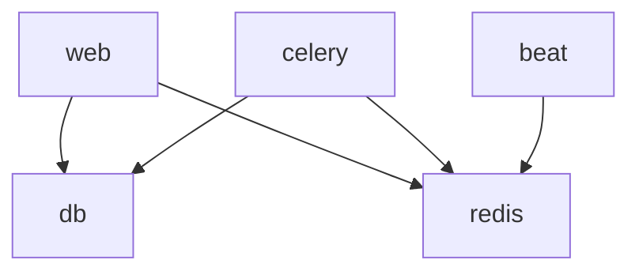

# Docker Guide - MapsProveFiber

**Version**: v2.0.0  
**Last Updated**: 2025-11-10  
**Target Audience**: Developers, DevOps

---

## 📖 Overview

This guide covers Docker-based development and deployment for MapsProveFiber, including Docker Compose orchestration, container management, and troubleshooting.

---

## 🚀 Quick Start

### Prerequisites

- Docker Engine 24+
- Docker Compose Plugin 2.20+
- 4GB RAM minimum
- 10GB free disk space

Verify installation:
```powershell
docker --version
docker compose version
```

### First Run

```powershell
# Clone repository
git clone https://github.com/kaled182/provemaps_beta.git
cd provemaps_beta

# Copy environment template
cp .env.example .env

# Start all services
docker compose up -d --build

# Check status
docker compose ps

# View logs
docker compose logs -f web
```

Access at http://localhost:8000

---

## 🏗️ Service Architecture

### Stack Components

```yaml
services:
  web:        # Django application (port 8000)
  celery:     # Async task worker
  beat:       # Celery scheduler
  redis:      # Cache & message broker
  db:         # MariaDB database
```

### Service Dependencies



---

## 🔧 Service Management

### Start/Stop Services

```powershell
# Start all services
docker compose up -d

# Start specific service
docker compose up -d web

# Stop all services
docker compose down

# Stop and remove volumes (DANGER: deletes data)
docker compose down -v

# Restart service
docker compose restart web

# Stop single service
docker compose stop celery
```

### Build & Rebuild

```powershell
# Build all images
docker compose build

# Build specific service
docker compose build web

# Build with no cache
docker compose build --no-cache

# Build and start
docker compose up -d --build
```

### View Status

```powershell
# List containers
docker compose ps

# View resource usage
docker compose stats

# Inspect service
docker compose config
```

---

## 📋 Logs & Debugging

### View Logs

```powershell
# All services
docker compose logs

# Specific service
docker compose logs web

# Follow logs (real-time)
docker compose logs -f web

# Last N lines
docker compose logs --tail=50 web

# Logs since timestamp
docker compose logs --since 2025-11-10T10:00:00 web

# Multiple services
docker compose logs web celery
```

### Execute Commands

```powershell
# Django shell
docker compose exec web python manage.py shell

# Database migrations
docker compose exec web python manage.py migrate

# Create superuser
docker compose exec web python manage.py createsuperuser

# Collect static files
docker compose exec web python manage.py collectstatic --noinput

# Run tests
docker compose exec web pytest -q

# Bash shell
docker compose exec web bash

# Root shell
docker compose exec -u root web bash
```

---

## 🗄️ Database Management

### Connect to Database

```powershell
# MySQL client
docker compose exec db mysql -u app -p

# Or with password inline
docker compose exec db mysql -u app -papp mapsprovefiber
```

### Backup & Restore

```powershell
# Create backup
docker compose exec db mysqldump -u app -papp mapsprovefiber > backup_$(date +%Y%m%d).sql

# Restore backup
docker compose exec -T db mysql -u app -papp mapsprovefiber < backup_20251110.sql

# Copy backup from container
docker compose cp db:/backup.sql ./backup.sql

# Import SQL file to container
docker compose cp init.sql db:/tmp/init.sql
docker compose exec db mysql -u app -papp mapsprovefiber < /tmp/init.sql
```

### Database Operations

```sql
-- Show databases
SHOW DATABASES;

-- Use database
USE mapsprovefiber;

-- Show tables
SHOW TABLES;

-- Describe table
DESCRIBE inventory_site;

-- Count records
SELECT COUNT(*) FROM inventory_site;

-- View data
SELECT * FROM inventory_site LIMIT 10;
```

---

## 🔴 Redis Management

### Connect to Redis

```powershell
# Redis CLI
docker compose exec redis redis-cli

# Execute command
docker compose exec redis redis-cli KEYS "*"
```

### Common Operations

```powershell
# Test connection
docker compose exec redis redis-cli PING

# View all keys
docker compose exec redis redis-cli KEYS "*"

# Get key value
docker compose exec redis redis-cli GET "cache_key"

# Delete key
docker compose exec redis redis-cli DEL "cache_key"

# Flush database
docker compose exec redis redis-cli FLUSHDB

# Flush all databases
docker compose exec redis redis-cli FLUSHALL

# Get database size
docker compose exec redis redis-cli DBSIZE

# Monitor commands
docker compose exec redis redis-cli MONITOR
```

---

## 🔄 Development Workflow

### Hot Reload Setup

The web service has volume mounts for hot reload:

```yaml
volumes:
  - .:/app                    # Source code
  - ./logs:/app/logs          # Logs
```

Changes to Python files automatically reload the server.

### Development Commands

```powershell
# Watch logs while developing
docker compose logs -f web

# Run tests on code change
docker compose exec web pytest -q

# Check code quality
docker compose exec web make lint

# Format code
docker compose exec web make fmt
```

### Environment Variables

Edit `.env` file:
```env
DEBUG=True
DJANGO_SETTINGS_MODULE=settings.dev
DB_HOST=db
REDIS_URL=redis://redis:6379/1
```

Restart services to apply:
```powershell
docker compose restart web celery
```

---

## 🐛 Troubleshooting

### Port Already in Use

```powershell
# Find process using port
netstat -ano | findstr :8000

# Kill process (Windows)
taskkill /PID <PID> /F

# Change port in docker-compose.yml
ports:
  - "8001:8000"  # Use 8001 instead
```

### Container Won't Start

```powershell
# View error logs
docker compose logs web

# Check service health
docker compose ps

# Recreate container
docker compose up -d --force-recreate web

# Start in foreground (see errors immediately)
docker compose up web
```

### Database Connection Failed

```powershell
# Check DB is running
docker compose ps db

# View DB logs
docker compose logs db

# Test connection
docker compose exec web python manage.py check --database default

# Verify credentials in .env
DB_HOST=db
DB_USER=app
DB_PASSWORD=app
DB_NAME=mapsprovefiber
```

### Redis Connection Failed

```powershell
# Check Redis is running
docker compose ps redis

# Test connection
docker compose exec redis redis-cli PING

# Check Redis logs
docker compose logs redis

# Test from Django
docker compose exec web python -c "from django.core.cache import cache; print(cache.get('test'))"
```

### Missing Static Files

```powershell
# Collect static files
docker compose exec web python manage.py collectstatic --noinput

# Check static files path
docker compose exec web ls -la staticfiles/

# Verify STATIC_ROOT in settings
docker compose exec web python manage.py diffsettings | grep STATIC
```

### Volume Permission Issues

```powershell
# Check volume permissions
docker compose exec web ls -la /app

# Fix permissions (Linux/Mac)
docker compose exec -u root web chown -R app:app /app

# On Windows, ensure Docker has access to drive
# Docker Desktop -> Settings -> Resources -> File Sharing
```

### Out of Disk Space

```powershell
# Check Docker disk usage
docker system df

# Remove unused containers
docker container prune

# Remove unused images
docker image prune -a

# Remove unused volumes (DANGER: deletes data)
docker volume prune

# Clean everything (DANGER)
docker system prune -a --volumes
```

---

## 📊 Monitoring

### Health Checks

Built-in health checks in `docker-compose.yml`:

```yaml
healthcheck:
  test: ["CMD", "curl", "-f", "http://localhost:8000/healthz"]
  interval: 30s
  timeout: 10s
  retries: 3
  start_period: 40s
```

Check status:
```powershell
docker compose ps
```

### Resource Monitoring

```powershell
# Real-time stats
docker compose stats

# Container inspect
docker compose inspect web

# View processes
docker compose top web
```

### Log Aggregation

```powershell
# Export logs
docker compose logs > all_logs.txt

# Filter logs
docker compose logs | grep ERROR

# JSON logs
docker compose logs --json
```

---

## 🔐 Security Best Practices

### Environment Secrets

```env
# .env (never commit!)
SECRET_KEY=<generate-secure-random-key>
DB_PASSWORD=<strong-password>
ZABBIX_API_PASSWORD=<strong-password>
```

Generate secure keys:
```powershell
# Python
python -c "from django.core.management.utils import get_random_secret_key; print(get_random_secret_key())"

# PowerShell
[Convert]::ToBase64String((1..32 | ForEach-Object { Get-Random -Maximum 256 }))
```

### Network Isolation

```yaml
networks:
  frontend:
    driver: bridge
  backend:
    driver: bridge

services:
  web:
    networks:
      - frontend
      - backend
  
  db:
    networks:
      - backend  # Not exposed to frontend
```

### Read-only Filesystems

```yaml
services:
  web:
    read_only: true
    tmpfs:
      - /tmp
      - /var/run
```

---

## 🚀 Production Deployment

### Production Configuration

```yaml
# docker-compose.prod.yml
services:
  web:
    environment:
      - DJANGO_SETTINGS_MODULE=settings.prod
      - DEBUG=False
    restart: always
    
  db:
    volumes:
      - db_data:/var/lib/mysql
    restart: always
    
  redis:
    restart: always

volumes:
  db_data:
```

Run:
```powershell
docker compose -f docker-compose.yml -f docker-compose.prod.yml up -d
```

### Health Checks

```powershell
# Liveness
curl http://localhost:8000/live

# Readiness
curl http://localhost:8000/ready

# Full health
curl http://localhost:8000/healthz
```

### Backup Strategy

```powershell
# Automated backup script
docker compose exec db mysqldump -u app -papp mapsprovefiber | gzip > backup_$(date +%Y%m%d_%H%M%S).sql.gz

# Schedule with cron (Linux) or Task Scheduler (Windows)
```

---

## 📚 Docker Compose Reference

### Common Commands

| Command | Description |
|---------|-------------|
| `docker compose up` | Start services |
| `docker compose down` | Stop and remove services |
| `docker compose ps` | List containers |
| `docker compose logs` | View logs |
| `docker compose exec` | Execute command in container |
| `docker compose build` | Build images |
| `docker compose pull` | Pull images |
| `docker compose restart` | Restart services |
| `docker compose stop` | Stop services |
| `docker compose start` | Start stopped services |

### Environment Files

```powershell
# Use custom env file
docker compose --env-file .env.prod up -d

# Override compose file
docker compose -f docker-compose.yml -f docker-compose.override.yml up -d
```

---

## 📖 Additional Resources

- [Docker Documentation](https://docs.docker.com/)
- [Docker Compose Documentation](https://docs.docker.com/compose/)
- [Development Guide](DEVELOPMENT.md)
- [Deployment Guide](../operations/DEPLOYMENT.md)
- [Troubleshooting Guide](../operations/TROUBLESHOOTING.md)

---

**Last Updated**: 2025-11-10  
**Maintainers**: DevOps Team
