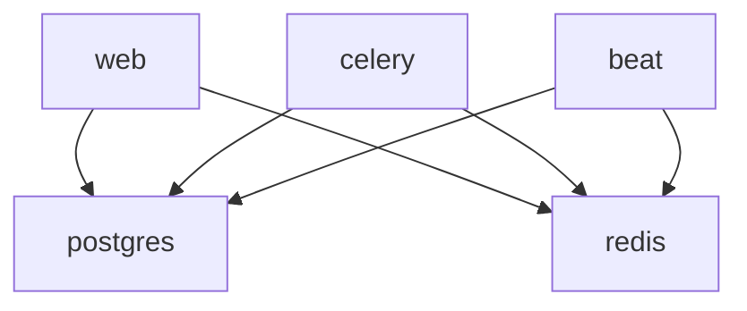

# Docker Guide - MapsProveFiber

**Versão do produto**: ver [VERSION](../../VERSION)  
**Last Updated**: 2026-10-04  
**Target Audience**: Developers, DevOps

---

## 📖 Overview

This guide covers Docker-based development and deployment for MapsProveFiber, including Docker Compose orchestration, container management, and troubleshooting.

> The development stack is `docker/docker-compose.yml` (PostgreSQL 16 + PostGIS; web published on host port **8100**). Commands below use `-f docker/docker-compose.yml` from the repo root; `make up`, `make down`, `make logs`, `make build` and `make restart` wrap the same file. Production uses `docker/docker-compose.prod.yml` (see [`DEPLOY.md`](../../DEPLOY.md)).

---

## 🚀 Quick Start

### Prerequisites

- Docker Engine 24+
- Docker Compose Plugin 2.20+
- 4GB RAM minimum
- 10GB free disk space

Verify installation:
```bash
docker --version
docker compose version
```

### First Run

```bash
# Clone repository
git clone https://github.com/kaled182/provemaps_beta.git
cd provemaps_beta

# Copy environment template
cp .env.example .env

# Start all services
docker compose -f docker/docker-compose.yml up -d --build

# Check status
docker compose -f docker/docker-compose.yml ps

# View logs
docker compose -f docker/docker-compose.yml logs -f web
```

Access at http://localhost:8100

---

## 🏗️ Service Architecture

### Stack Components

```yaml
services:
  web:        # Django application (container port 8000, host port 8100)
  celery:     # Async task worker (queues default, zabbix, maps)
  beat:       # Celery scheduler
  redis:      # Cache & message broker
  postgres:   # PostgreSQL 16 + PostGIS (host port 5433)
  # plus prometheus, grafana, video-hls, video-transmuxer, mediamtx, whatsapp-qr
```

### Service Dependencies


```mermaid
graph TD
    web --> postgres
    web --> redis
    celery --> postgres
    celery --> redis
    beat --> postgres
    beat --> redis
```

---

## 🔧 Service Management

### Start/Stop Services

```bash
# Start all services
docker compose -f docker/docker-compose.yml up -d

# Start specific service
docker compose -f docker/docker-compose.yml up -d web

# Stop all services
docker compose -f docker/docker-compose.yml down

# Stop and remove volumes (DANGER: deletes data)
docker compose -f docker/docker-compose.yml down -v

# Restart service
docker compose -f docker/docker-compose.yml restart web

# Stop single service
docker compose -f docker/docker-compose.yml stop celery
```

### Build & Rebuild

```bash
# Build all images
docker compose -f docker/docker-compose.yml build

# Build specific service
docker compose -f docker/docker-compose.yml build web

# Build with no cache
docker compose -f docker/docker-compose.yml build --no-cache

# Build and start
docker compose -f docker/docker-compose.yml up -d --build
```

### View Status

```bash
# List containers
docker compose -f docker/docker-compose.yml ps

# View resource usage
docker stats

# Inspect service
docker compose -f docker/docker-compose.yml config
```

---

## 📋 Logs & Debugging

### View Logs

```bash
# All services
docker compose -f docker/docker-compose.yml logs

# Specific service
docker compose -f docker/docker-compose.yml logs web

# Follow logs (real-time)
docker compose -f docker/docker-compose.yml logs -f web

# Last N lines
docker compose -f docker/docker-compose.yml logs --tail=50 web

# Logs since timestamp
docker compose -f docker/docker-compose.yml logs --since 2025-11-10T10:00:00 web

# Multiple services
docker compose -f docker/docker-compose.yml logs web celery
```

### Execute Commands

```bash
# Django shell
docker compose -f docker/docker-compose.yml exec web python manage.py shell

# Database migrations
docker compose -f docker/docker-compose.yml exec web python manage.py migrate

# Create superuser
docker compose -f docker/docker-compose.yml exec web python manage.py createsuperuser

# Collect static files
docker compose -f docker/docker-compose.yml exec web python manage.py collectstatic --noinput

# Run tests
docker compose -f docker/docker-compose.yml exec web pytest -q

# Bash shell
docker compose -f docker/docker-compose.yml exec web bash

# Root shell
docker compose -f docker/docker-compose.yml exec -u root web bash
```

---

## 🗄️ Database Management

### Connect to Database

```bash
# psql client (service `postgres`, database `app`, user `app`)
docker compose -f docker/docker-compose.yml exec postgres psql -U app -d app
```

### Backup & Restore

```bash
# Create backup
docker compose -f docker/docker-compose.yml exec postgres pg_dump -U app app > backup_$(date +%Y%m%d).sql

# Restore backup
docker compose -f docker/docker-compose.yml exec -T postgres psql -U app -d app < backup_20251110.sql

# Copy a file from the container
docker compose -f docker/docker-compose.yml cp postgres:/tmp/backup.sql ./backup.sql

# Import SQL file to container
docker compose -f docker/docker-compose.yml cp init.sql postgres:/tmp/init.sql
docker compose -f docker/docker-compose.yml exec postgres psql -U app -d app -f /tmp/init.sql
```

### Database Operations

```sql
-- Show databases (psql: \l)
SELECT datname FROM pg_database;

-- Show tables (psql: \dt)
SELECT tablename FROM pg_tables WHERE schemaname = 'public';

-- Describe table (psql: \d zabbix_api_site)
-- NB: `zabbix_api_site` is an inherited table name; the Site model lives in `inventory`

-- Count records
SELECT COUNT(*) FROM zabbix_api_site;

-- View data
SELECT * FROM zabbix_api_site LIMIT 10;

-- Check PostGIS
SELECT PostGIS_Version();
```

---

## 🔴 Redis Management

### Connect to Redis

```bash
# Redis CLI
docker compose -f docker/docker-compose.yml exec redis redis-cli

# Execute command
docker compose -f docker/docker-compose.yml exec redis redis-cli KEYS "*"
```

### Common Operations

```bash
# Test connection
docker compose -f docker/docker-compose.yml exec redis redis-cli PING

# View all keys
docker compose -f docker/docker-compose.yml exec redis redis-cli KEYS "*"

# Get key value
docker compose -f docker/docker-compose.yml exec redis redis-cli GET "cache_key"

# Delete key
docker compose -f docker/docker-compose.yml exec redis redis-cli DEL "cache_key"

# Flush database
docker compose -f docker/docker-compose.yml exec redis redis-cli FLUSHDB

# Flush all databases
docker compose -f docker/docker-compose.yml exec redis redis-cli FLUSHALL

# Get database size
docker compose -f docker/docker-compose.yml exec redis redis-cli DBSIZE

# Monitor commands
docker compose -f docker/docker-compose.yml exec redis redis-cli MONITOR
```

---

## 🔄 Development Workflow

### Hot Reload Setup

The web service has volume mounts so code changes are visible without rebuilding the image:

```yaml
volumes:
  - ../backend:/app/backend    # Source code
  - ../frontend:/app/frontend
  - ../logs:/app/backend/logs  # Logs
```

The web service runs Gunicorn without `--reload`: restart it (`docker compose -f docker/docker-compose.yml restart web`) to pick up Python changes. Rebuild the SPA with `cd frontend && npm run build`.

### Development Commands

```bash
# Watch logs while developing
docker compose -f docker/docker-compose.yml logs -f web

# Run tests on code change
docker compose -f docker/docker-compose.yml exec web pytest -q

# Check code quality (from the host, in the repo root; needs `make requirements-dev`)
make lint
```

### Environment Variables

Edit `.env` file:
```env
DEBUG=True
DJANGO_SETTINGS_MODULE=settings.dev
# DB_ENGINE=postgis and DB_HOST=postgres are already set in docker/docker-compose.yml
REDIS_URL=redis://redis:6379/1
```

Restart services to apply:
```bash
docker compose -f docker/docker-compose.yml restart web celery
```

---

## 🐛 Troubleshooting

### Port Already in Use

```bash
# Find process using port
ss -ltnp | grep :8100

# Kill process (replace PID)
kill <PID>

# Change port in docker/docker-compose.yml
ports:
  - "8101:8000"  # Use 8101 instead
```

### Container Won't Start

```bash
# View error logs
docker compose -f docker/docker-compose.yml logs web

# Check service health
docker compose -f docker/docker-compose.yml ps

# Recreate container
docker compose -f docker/docker-compose.yml up -d --force-recreate web

# Start in foreground (see errors immediately)
docker compose -f docker/docker-compose.yml up web
```

### Database Connection Failed

```bash
# Check DB is running
docker compose -f docker/docker-compose.yml ps postgres

# View DB logs
docker compose -f docker/docker-compose.yml logs postgres

# Test connection
docker compose -f docker/docker-compose.yml exec web python manage.py check --database default

# Verify credentials (set in docker/docker-compose.yml; override in .env only if needed)
DB_ENGINE=postgis
DB_HOST=postgres
DB_USER=app
DB_PASSWORD=app
DB_NAME=app
```

### Redis Connection Failed

```bash
# Check Redis is running
docker compose -f docker/docker-compose.yml ps redis

# Test connection
docker compose -f docker/docker-compose.yml exec redis redis-cli PING

# Check Redis logs
docker compose -f docker/docker-compose.yml logs redis

# Test from Django
docker compose -f docker/docker-compose.yml exec web python -c "from django.core.cache import cache; print(cache.get('test'))"
```

### Missing Static Files

```bash
# Collect static files
docker compose -f docker/docker-compose.yml exec web python manage.py collectstatic --noinput

# Check static files path
docker compose -f docker/docker-compose.yml exec web ls -la staticfiles/

# Verify STATIC_ROOT in settings
docker compose -f docker/docker-compose.yml exec web python manage.py diffsettings | grep STATIC
```

### Volume Permission Issues

```bash
# Check volume permissions
docker compose -f docker/docker-compose.yml exec web ls -la /app

# Fix permissions (the image runs as `appuser`)
docker compose -f docker/docker-compose.yml exec -u root web chown -R appuser:appuser /app
```

### Out of Disk Space

```bash
# Check Docker disk usage
docker system df

# Remove unused containers
docker container prune

# Remove unused images
docker image prune -a

# Remove unused volumes (DANGER: deletes data)
docker volume prune

# Clean everything (DANGER)
docker system prune -a --volumes
```

---

## 📊 Monitoring

### Health Checks

Built-in health checks in `docker/docker-compose.yml` (web probes `/ready`; postgres uses `pg_isready`; redis uses `redis-cli ping`):

```yaml
healthcheck:
  test: ["CMD-SHELL", "python -c \"import urllib.request; resp = urllib.request.urlopen('http://localhost:8000/ready', timeout=5); exit(0 if resp.getcode() == 200 else 1)\" || exit 1"]
  interval: 30s
  timeout: 15s
  retries: 3
  start_period: 40s
```

Check status:
```bash
docker compose -f docker/docker-compose.yml ps
```

### Resource Monitoring

```bash
# Real-time stats
docker stats

# Container inspect
docker inspect <container>

# View processes
docker compose -f docker/docker-compose.yml top web
```

### Log Aggregation

```bash
# Export logs
docker compose -f docker/docker-compose.yml logs > all_logs.txt

# Filter logs
docker compose -f docker/docker-compose.yml logs | grep ERROR

```

---

## 🔐 Security Best Practices

### Environment Secrets

```env
# .env (never commit!)
SECRET_KEY=<generate-secure-random-key>
DB_PASSWORD=<strong-password>
ZABBIX_API_PASSWORD=<strong-password>
```

Generate secure keys:
```bash
# Python
python -c "from django.core.management.utils import get_random_secret_key; print(get_random_secret_key())"

# OpenSSL
openssl rand -base64 50
```

### Network Isolation

```yaml
networks:
  frontend:
    driver: bridge
  backend:
    driver: bridge

services:
  web:
    networks:
      - frontend
      - backend
  
  postgres:
    networks:
      - backend  # Not exposed to frontend
```

### Read-only Filesystems

```yaml
services:
  web:
    read_only: true
    tmpfs:
      - /tmp
      - /var/run
```

---

## 🚀 Production Deployment

### Production Configuration

Production is a standalone compose file, `docker/docker-compose.prod.yml` (nginx + certbot, web, celery, celery-beat, postgres, redis; optional profiles `monitoring`, `video`, `whatsapp`, `full`). It is **not** an overlay on the dev file. Configure `.env.production` and deploy with the script — full steps in [`DEPLOY.md`](../../DEPLOY.md):

```bash
cp .env.production.example .env.production
./scripts/deploy.sh --profile minimal --init-data
```

### Health Checks

```bash
# Liveness (dev stack: port 8100; production: https://<DOMAIN_NAME>/...)
curl http://localhost:8100/live

# Readiness
curl http://localhost:8100/ready

# Full health
curl http://localhost:8100/healthz
```

### Backup Strategy

```bash
# Manual backup (dev stack); `scripts/deploy.sh` takes a pre-deploy backup in production
docker compose -f docker/docker-compose.yml exec -T postgres pg_dump -U app app | gzip > backup_$(date +%Y%m%d_%H%M%S).sql.gz

# Schedule with cron
```

---

## 📚 Docker Compose Reference

### Common Commands

| Command | Description |
|---------|-------------|
| `docker compose up` | Start services |
| `docker compose down` | Stop and remove services |
| `docker compose ps` | List containers |
| `docker compose logs` | View logs |
| `docker compose exec` | Execute command in container |
| `docker compose build` | Build images |
| `docker compose pull` | Pull images |
| `docker compose restart` | Restart services |
| `docker compose stop` | Stop services |
| `docker compose start` | Start stopped services |

### Environment Files

```bash
# Use custom env file
docker compose -f docker/docker-compose.prod.yml --env-file .env.production up -d

# Override compose file
docker compose -f docker/docker-compose.yml -f docker-compose.override.yml up -d
```

---

## 📖 Additional Resources

- [Docker Documentation](https://docs.docker.com/)
- [Docker Compose Documentation](https://docs.docker.com/compose/)
- [Development Guide](DEVELOPMENT.md)
- [Deployment Guide](../../DEPLOY.md) (production compose: `docker/docker-compose.prod.yml`)
- [Production Docker notes](../operations/DOCKER_PRODUCTION.md)
- [Troubleshooting notes](../troubleshooting/)

---

**Last Updated**: 2026-10-04  
**Maintainers**: DevOps Team
