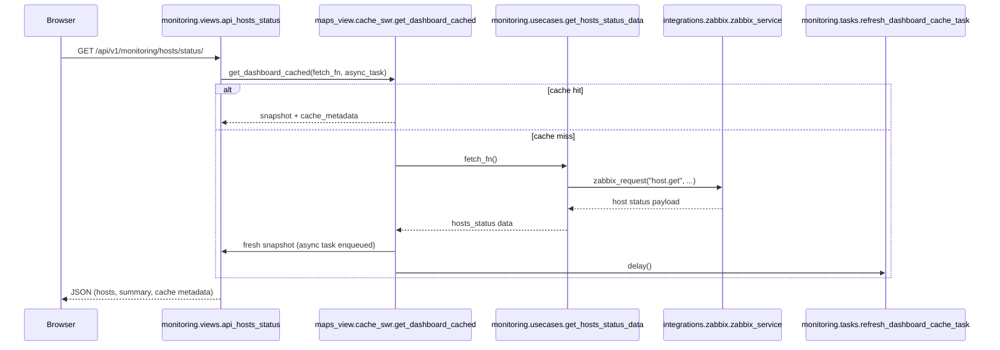
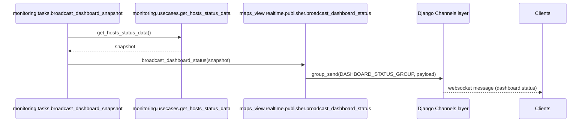

# Monitoring Dashboard Data Flow

This note documents how the dashboard data moves across the new `monitoring` app after migrating the host status logic out of `maps_view`.

## API Sequence (SWR)

## Background Refresh

- Task: `monitoring.tasks.refresh_dashboard_cache_task`
- Triggered by: Celery beat entry `refresh-dashboard-cache`
- Responsibilities:
  1. Calls `monitoring.usecases.get_hosts_status_data()` to pull the latest snapshot.
  2. Persists the payload via `maps_view.cache_swr.dashboard_cache.set_cached_data`.
  3. Emits timing and host count details to the log for observability.

## Realtime Broadcast

The Celery schedule keeps `broadcast_dashboard_snapshot` optional; callers can trigger it manually or on demand.

## Compatibility Shims

Legacy imports remain valid while downstream code migrates:

- `maps_view.services` re-exports the monitoring use cases (class + helper functions).
- `maps_view.tasks` re-exports the broadcast and refresh tasks, plus `get_hosts_status_data` alias.
- Tests under `tests/test_maps_view_tasks.py` guarantee these shims keep pointing at the monitoring modules.

## Endpoint Reference

| Purpose | HTTP route | Django view |
|---------|------------|-------------|
| Dashboard HTML | `/maps_view/dashboard/` | `maps_view.views.dashboard_view` |
| Metrics HTML | `/maps_view/metrics/` | `maps_view.views.metrics_dashboard` |
| Host status API | `/api/v1/monitoring/hosts/status/` | `monitoring.views.api_hosts_status` |
| Snapshot API (no cache) | `/api/v1/monitoring/dashboard/snapshot/` | `monitoring.views.api_dashboard_snapshot` |

## Validation

- API flow covered by `monitoring/tests/test_views.py`.
- Task shims validated in `tests/test_maps_view_tasks.py`.
- Celery beat entry asserted in `tests/test_celery_schedule.py`.
- Realtime JSON contract verified in `tests/test_realtime.py::DashboardRealtimeTests::test_hosts_status_api_returns_payload`.
