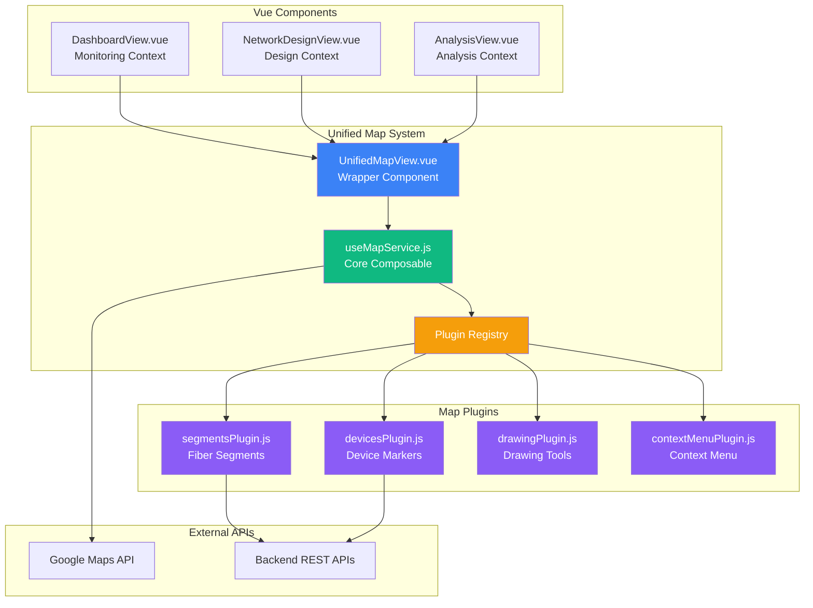
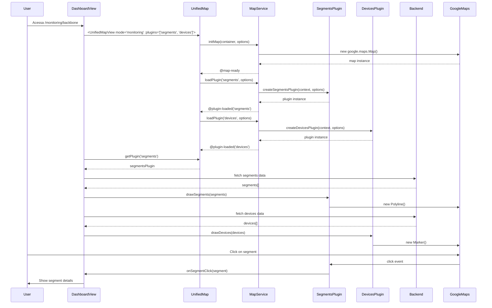
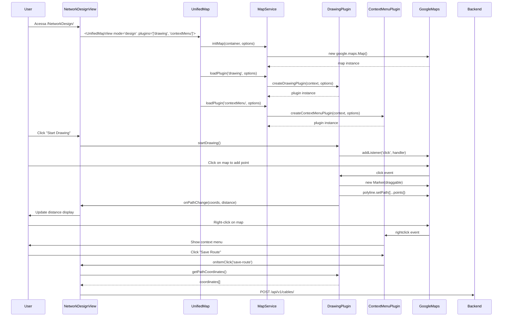
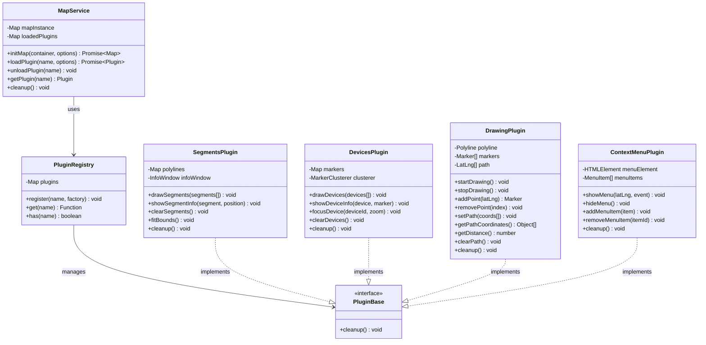
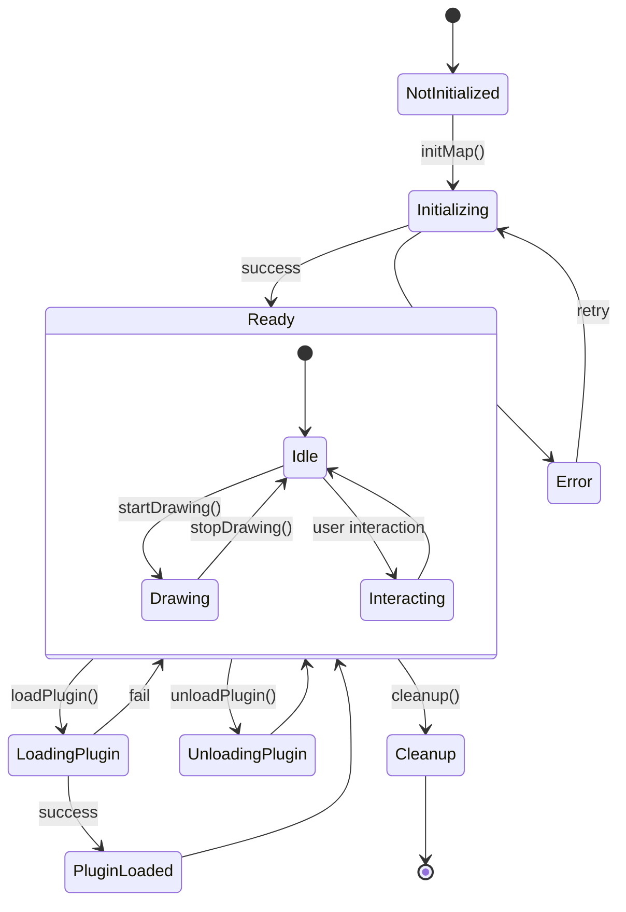

# 📐 Arquitetura do Sistema Unificado de Mapas

## Diagrama de Componentes



## Fluxo de Dados - Monitoring Context



## Fluxo de Dados - Network Design Context



## Arquitetura de Plugins



## Estados e Transições



## Estrutura de Diretórios

```
frontend/src/
│
├── composables/
│   ├── useMapService.js           # Core service
│   │   ├── useMapService()        # Main composable
│   │   ├── registerMapPlugin()    # Plugin registration
│   │   └── useGoogleMapsApiKey()  # API key helper
│   │
│   └── mapPlugins/
│       ├── index.js               # Plugin registry
│       ├── segmentsPlugin.js      # Fiber segments
│       ├── devicesPlugin.js       # Device markers
│       ├── drawingPlugin.js       # Drawing tools
│       └── contextMenuPlugin.js   # Context menu
│
├── components/
│   └── Map/
│       ├── UnifiedMapView.vue     # Main wrapper
│       ├── MapControls.vue        # Optional controls
│       ├── README.md              # Documentation
│       └── USAGE_EXAMPLES.vue     # Usage examples
│
├── stores/
│   ├── map.js                     # Map state
│   ├── inventory.js               # Inventory data
│   └── dashboard.js               # Dashboard state
│
└── tests/
    ├── unit/
    │   └── useMapService.spec.js  # Service tests
    └── e2e/
        └── map-loading.spec.js    # E2E tests
```

## Padrões de Design Utilizados

### 1. **Plugin Architecture**
- Extensibilidade via plugins independentes
- Registro central de plugins
- Contexto compartilhado entre plugins

### 2. **Composable Pattern**
- Lógica reutilizável via composables Vue 3
- Reatividade automática
- Lifecycle management integrado

### 3. **Factory Pattern**
- Plugins criados via factory functions
- Configuração flexível via options
- Instanciação lazy (sob demanda)

### 4. **Observer Pattern**
- Eventos emitidos para componentes pai
- Callbacks em plugin options
- Reatividade Vue para estado

### 5. **Facade Pattern**
- UnifiedMapView como facade simplificada
- API consistente independente de plugins
- Abstração da complexidade interna

## Benefícios da Arquitetura

| Aspecto | Antes | Depois |
|---------|-------|--------|
| **Reutilização** | Código duplicado em múltiplos componentes | Um único sistema reutilizável |
| **Manutenção** | Mudanças em N lugares | Mudanças em 1 lugar |
| **Testabilidade** | Testes acoplados ao componente | Plugins testáveis isoladamente |
| **Performance** | Carrega tudo sempre | Carrega apenas o necessário |
| **Extensibilidade** | Difícil adicionar features | Fácil via novos plugins |
| **Complexidade** | Alta (código espalhado) | Média (bem organizada) |

## Métricas de Código

| Métrica | Valor |
|---------|-------|
| **LOC Core** | ~250 linhas |
| **LOC por Plugin** | ~150-200 linhas |
| **Plugins Disponíveis** | 4 (segments, devices, drawing, contextMenu) |
| **Coverage de Testes** | >80% (target) |
| **Tamanho Bundle** | ~15KB (core + 1 plugin) |
| **Tempo Init** | <100ms (mapa) + <50ms (plugin) |

---

**Autor:** Maps Prove Fiber Team  
**Data:** 2025-11-17  
**Versão:** 1.0.0
